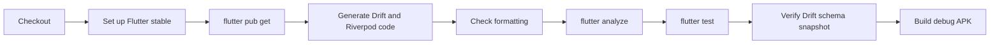

# Continuous Integration

GitHub Actions verifies every pull request into `main`, every push to `main`, and
manual workflow dispatches.

## Workflow

The workflow is defined in `.github/workflows/ci.yml` and runs on Ubuntu.



## Steps

### Checkout

Fetches the repository source.

### Flutter setup

Uses the stable Flutter channel with dependency caching enabled.

### Dependency installation

```bash
flutter pub get
```

### Code generation

```bash
dart run build_runner build
```

This step is mandatory because generated `*.g.dart` files are ignored by Git.
It catches incompatible annotations or schemas before analysis.

### Formatting

```bash
dart format --output=none --set-exit-if-changed .
```

The pipeline fails when committed Dart code is not formatted.

### Analysis

```bash
flutter analyze
```

The repository uses strict casts, inference, and raw-type checking in addition
to project lint rules.

### Tests

```bash
flutter test
```

Runs database, migration, repository, routing, and widget tests.

### Drift schema snapshot verification

CI runs:

```bash
dart run drift_dev schema dump lib/db/app_database.dart drift_schemas/
```

It then checks `git status` for changes under `drift_schemas/`. If dumping the
current database schema modifies the committed snapshot, CI fails and the new
snapshot must be reviewed and committed.

This keeps migration history synchronized with the actual Drift declarations.

### Build verification

```bash
flutter build apk --debug
```

Confirms the Android application compiles after code generation and tests.

## Branch protection

`main` should require the CI check before merge. Repository settings enforce that
policy; the workflow file itself cannot guarantee branch protection.

## Release CI later

Google Play release automation should remain separate from pull-request CI. A
future release workflow can build a signed Android App Bundle, while the current
workflow remains a fast correctness gate.
