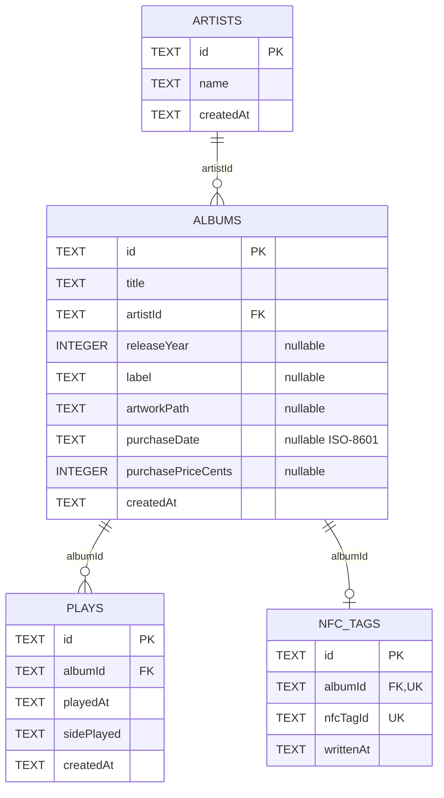

# Database Architecture

Vinyl App uses Drift as a type-safe Dart layer over a local SQLite database.
SQLite is the source of truth for core collection and listening data.

## Connection lifecycle

`AppDatabase` accepts an optional `QueryExecutor`:

```dart
AppDatabase([QueryExecutor? executor])
```

- Production uses a lazy file-backed connection.
- Tests inject `NativeDatabase.memory()`.

The production database file is opened in the application documents directory:

```text
vinyl_app_db.sqlite
```

`NativeDatabase.createInBackground` keeps database work off the main isolate.

## Riverpod ownership

`databaseProvider` is marked `keepAlive: true` and closes the connection when its
owning provider container is disposed. `main.dart` watches the provider at the
application root so its lifetime follows the root `ProviderScope`.

The connection itself is still lazy. Constructing `AppDatabase` does not prove
that the underlying SQLite connection has opened or that migrations have run.
VinylApp-068 should add explicit bootstrap initialization before dismissing the
splash screen.

## Current schema — v2



### Artists

Defined in `lib/db/schema/artists.dart`. Generates `Artist` and
`ArtistsCompanion`.

### Albums

Defined in `lib/db/schema/albums.dart`. `artistId` references `Artists.id`.
Generates `Album` and `AlbumsCompanion`.

### Plays

Defined in `lib/db/schema/plays.dart`. `albumId` references `Albums.id`.
`SidePlayedConverter` persists `full`, `sideA`, and `sideB` as text. Generates
`Play` and `PlaysCompanion`.

### NFC tags

Defined in `lib/db/schema/nfc_tags.dart` for VinylApp-040.

| Column | Drift type | Required | Notes |
| --- | --- | --- | --- |
| `id` | Text | Yes | Primary key |
| `albumId` | Text | Yes | Unique foreign key to `Albums.id` |
| `nfcTagId` | Text | Yes | Unique physical tag identifier |
| `writtenAt` | Text | Yes | ISO-8601 timestamp by current convention |

The unique `nfcTagId` constraint prevents one physical tag identifier from being
registered more than once. `albumId` is also unique, enforcing the current
product rule that an album has at most one registered NFC tag. A join from
`NfcTags.albumId` to `Albums.id` can resolve a scanned tag to its album in one
database query.

## Foreign-key enforcement

SQLite does not enforce foreign keys unless enabled on the connection. The
`beforeOpen` migration hook runs:

```sql
PRAGMA foreign_keys = ON;
```

## Migration workflow

### v1 baseline

VinylApp-012 established v1 with Artists, Albums, and Plays. That baseline is
immutable and remains captured in:

```text
drift_schemas/drift_schema_v1.json
```

`migrateToV1()` spells out the frozen Artists, Albums, and Plays DDL rather than
calling `createAll()`, so adding newer tables cannot silently change what v1
means. Fresh v2 installs call that v1 helper and then explicitly create
`NfcTags`. Existing v1 installs run only the v1 → v2 upgrade step.

### v2 — VinylApp-040

VinylApp-040 adds `NfcTags` and advances the schema version:

```dart
abstract final class SchemaVersions {
  static const int v1 = 1;
  static const int v2 = 2;
  static const int current = v2;
}
```

A fresh v2 install creates the frozen v1 tables first and then creates `NfcTags`.
Existing v1 installations run the explicit v1 → v2 step, which creates only
`nfc_tags` and preserves the original tables and data.

Before merging 040, generate the v2 snapshot:

```bash
dart run drift_dev schema dump lib/db/app_database.dart drift_schemas/
```

The expected new versioned artifact is `drift_schema_v2.json`.

## Generated types

| Table class | Row class | Companion class |
| --- | --- | --- |
| `Artists` | `Artist` | `ArtistsCompanion` |
| `Albums` | `Album` | `AlbumsCompanion` |
| `Plays` | `Play` | `PlaysCompanion` |
| `NfcTags` | `NfcTag` | `NfcTagsCompanion` |

After schema changes, run:

```bash
dart run build_runner build
```

## Testing

Current database coverage verifies:

- the database can open and execute a query in memory;
- Artists, Albums, and Plays preserve their existing behavior;
- NFC tag IDs are unique;
- an Album can have at most one registered NFC tag;
- an NFC tag cannot reference a missing Album;
- an NFC tag can resolve its Album with one joined query;
- a fresh database creates the complete v2 schema;
- a database in the v1 physical shape upgrades to v2 while preserving Artist, Album, and Play data.

See [testing documentation](../development/testing.md).
