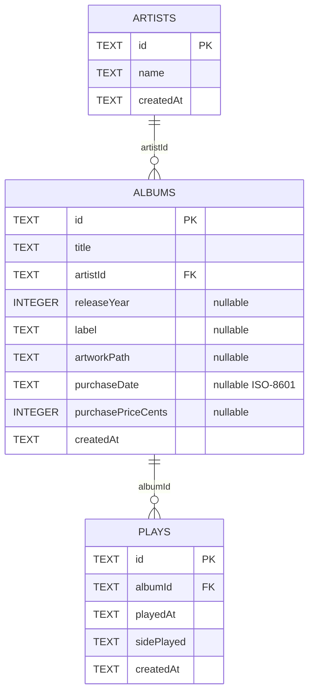

# Database Architecture

Vinyl App uses Drift as a type-safe Dart layer over a local SQLite database.
SQLite is the source of truth for core collection and listening data.

## Connection lifecycle

`AppDatabase` accepts an optional `QueryExecutor`:

```dart
AppDatabase([QueryExecutor? executor])
```

- Production uses a lazy file-backed connection.
- Tests inject `NativeDatabase.memory()`.

The production database file is opened in the application documents directory:

```text
vinyl_app_db.sqlite
```

`NativeDatabase.createInBackground` keeps database work off the main isolate.

## Riverpod ownership

`databaseProvider` is marked `keepAlive: true` and closes the connection when its
owning provider container is disposed. `main.dart` watches it at startup to make
the connection eager.

## Current schema — v1



### Artists

Defined in `lib/db/schema/artists.dart`.

| Column | Drift type | Required | Notes |
| --- | --- | --- | --- |
| `id` | Text | Yes | Primary key |
| `name` | Text | Yes | Artist display name |
| `createdAt` | Text | Yes | ISO-8601 timestamp by current convention |

Generates `Artist` and `ArtistsCompanion`.

### Albums

Defined in `lib/db/schema/albums.dart`.

| Column | Drift type | Required | Notes |
| --- | --- | --- | --- |
| `id` | Text | Yes | Primary key |
| `title` | Text | Yes | Album title |
| `artistId` | Text | Yes | Foreign key to `Artists.id` |
| `releaseYear` | Integer | No | Release year |
| `label` | Text | No | Record label |
| `artworkPath` | Text | No | Local artwork location |
| `purchaseDate` | Text | No | ISO-8601 date by current convention |
| `purchasePriceCents` | Integer | No | Currency stored as cents |
| `createdAt` | Text | Yes | ISO-8601 timestamp by current convention |

Generates `Album` and `AlbumsCompanion`.

### Plays

Defined in `lib/db/schema/plays.dart`.

| Column | Drift type | Required | Notes |
| --- | --- | --- | --- |
| `id` | Text | Yes | Primary key |
| `albumId` | Text | Yes | Foreign key to `Albums.id` |
| `playedAt` | Text | Yes | ISO-8601 timestamp |
| `sidePlayed` | Text + converter | Yes | `full`, `sideA`, or `sideB` |
| `createdAt` | Text | Yes | Record creation timestamp |

`SidePlayedConverter` persists the Dart `SidePlayed` enum as text. The table
generates `Play` and `PlaysCompanion`.

## Foreign-key enforcement

SQLite does not enforce foreign keys unless enabled on the connection. The
`beforeOpen` migration hook runs:

```sql
PRAGMA foreign_keys = ON;
```

Tests verify invalid album references fail, and the v1 schema snapshot records
the Artist → Album → Play relationships.

## Migration workflow

VinylApp-012 established the initial migration baseline.

`lib/db/migrations/schema_versions.dart` owns stable version constants:

```dart
abstract final class SchemaVersions {
  static const int v1 = 1;
  static const int current = v1;
}
```

`AppDatabase.schemaVersion` returns `SchemaVersions.current`.

A fresh database is created through `migrateToV1()` in
`lib/db/migrations/migration_v1.dart`:

```dart
Future<void> migrateToV1(Migrator migrator) async {
  await migrator.createAll();
}
```

The committed v1 snapshot is:

```text
drift_schemas/drift_schema_v1.json
```

The migration test proves that an empty database opens as schema version 1 and
contains `artists`, `albums`, and `plays`.

### Future versions

When a schema-changing task introduces v2 or later:

1. Add a stable version constant.
2. Add an explicit upgrade step rather than rewriting shipped history.
3. Regenerate Drift code.
4. Export and commit the new schema snapshot.
5. Add a step-up migration test from the previous version.

Do not modify the meaning of v1 after it has been treated as a released schema
baseline.

## Generated types

| Table class | Row class | Companion class |
| --- | --- | --- |
| `Artists` | `Artist` | `ArtistsCompanion` |
| `Albums` | `Album` | `AlbumsCompanion` |
| `Plays` | `Play` | `PlaysCompanion` |

After schema changes, run:

```bash
dart run build_runner build
```

For a schema-version change, also export the schema snapshot.

## Testing

Current database coverage verifies:

- the database can open and execute a query in memory;
- Artists can be inserted and read;
- Albums enforce their Artist foreign key;
- Plays persist and query by album ID;
- `SidePlayed` values round-trip through Drift;
- empty database → v1 creates all three tables and sets `PRAGMA user_version`.

See [testing documentation](../development/testing.md).
