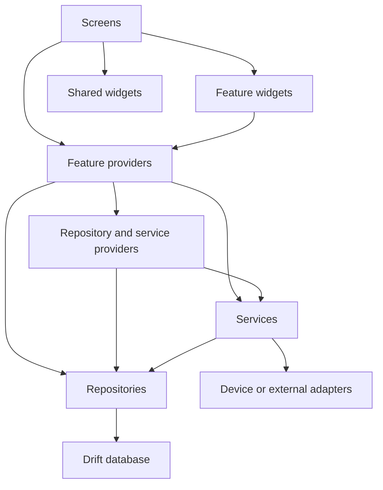
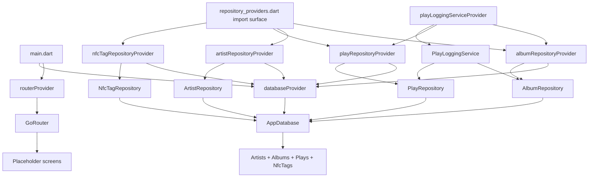
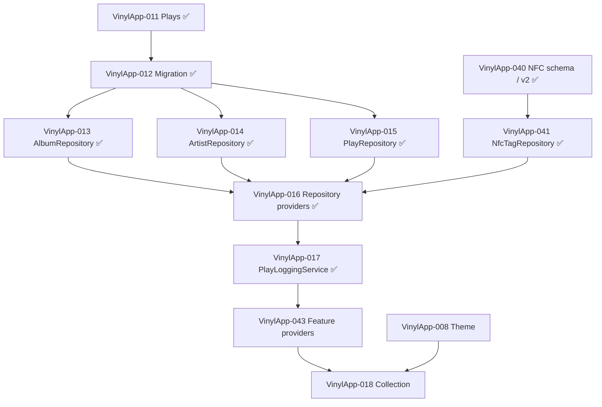

# Dependency Graph

## Allowed direction

## Rules

- Screens may depend on providers, routing, and widgets.
- Widgets expose data and callbacks; they do not construct repositories.
- Providers expose repositories, services, and asynchronous feature state.
- Services coordinate multi-step workflows.
- Repositories own Drift queries.
- Drift code must not import feature UI.
- Shared layers must not depend on one feature's presentation code.

## Current graph through VinylApp-017

The Album, Artist, Play, and NFC-tag repository boundaries now exist.
VinylApp-016 provides a single import surface plus override coverage.
VinylApp-017 adds PlayLoggingService and its provider; feature providers remain
planned and no feature screen consumes repository/service state yet.

## Collection ticket dependency graph

VinylApp-017 now unlocks the actual play-logging workflow. VinylApp-043 is the
direct task that provides the state named in VinylApp-018.

## Prototype exception

The unmerged VinylApp-018 branch skips this graph by using fake data and local
state. That makes it a visual prototype, not the final Collection architecture.
