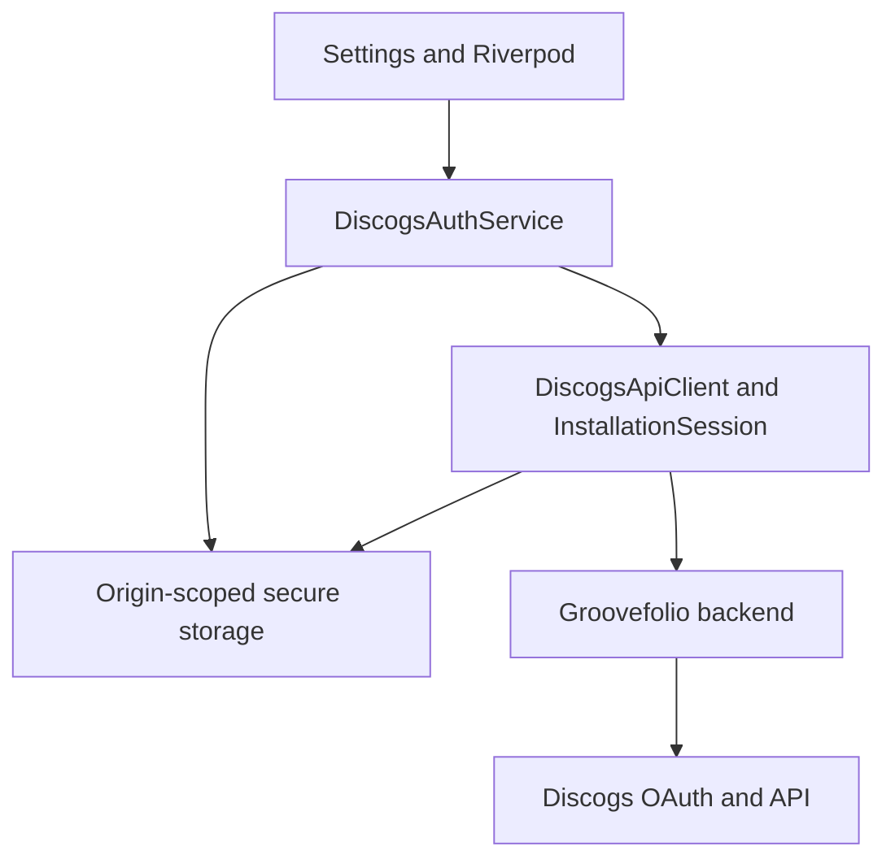

# Dependency graph

## Local data path

```text
Collection / Add / Edit / Detail / Log Play / Stats
                       ↓
        album/genre/stat feature providers
                       ↓
     services where workflows need coordination
                       ↓
AlbumRepository  ArtistRepository  PlayRepository
GenreRepository  NfcTagRepository
                       ↓
                 AppDatabase
                       ↓
                    SQLite
```

## Filesystem path

```text
Add/Edit artwork UI
      ↓
ArtworkPicker
      ↓
ArtworkStorageService
      ↓
application documents/artwork/<albumId>.jpg
```

## Delete path

```text
Album Detail → AlbumDeletionService
                   ├─ AlbumRepository → database cascade for related rows
                   └─ ArtworkStorageService (after DB commit)
```

Plays, NFC associations, genres, Discogs release links, and tracks are removed by database cascade when the album row is deleted.

## Discogs account connection


```mermaid
flowchart TD
    Settings["Settings and Riverpod"] --> Auth["DiscogsAuthService"]
    Auth --> API["DiscogsApiClient and InstallationSession"]
    Auth --> Store["Origin-scoped secure storage"]
    API --> Store
    API --> Backend["Groovefolio backend"]
    Backend --> Discogs["Discogs OAuth and API"]
```

The browser completes the backend HTTPS callback. Return to Settings and tap
**Check connection** to query the saved transaction. Legacy custom-scheme links
only trigger a server check; they do not supply credentials. NFC links keep their
separate routing. See [Discogs integration](../integrations/discogs.md).
