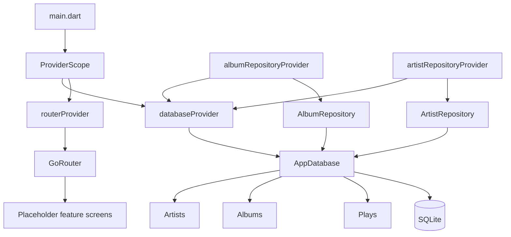
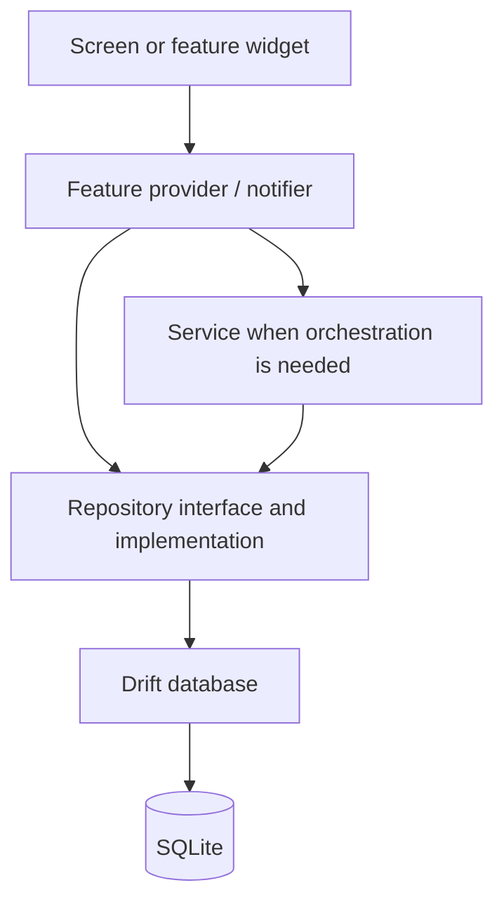

# Architecture Overview

## Purpose

Vinyl App is a local-first Flutter application. Its architecture keeps UI,
state, business workflows, and persistence separate enough to test and evolve
independently without creating abstractions before they are needed.

## Current architecture

The codebase now contains the application composition root, Riverpod-provided
router and database, the full v1 Drift schema, migration infrastructure, and the
AlbumRepository and ArtistRepository implementations.

`main.dart` eagerly watches the database provider so the connection is opened at
application startup. It also watches the router provider and passes the router
to `MaterialApp.router`.

`AlbumRepository` and `ArtistRepository` are not yet connected to a real
feature screen. They establish persistence boundaries that later providers and
services will consume.

## Target architecture

A provider may call a repository directly for a simple read or write. A service
is appropriate when one action coordinates several repositories, hardware APIs,
or domain rules.

## Layer responsibilities

### Presentation

Feature screens and widgets render state, capture user intent, and navigate.
They should not contain SQL or multi-step business workflows.

### Providers

Riverpod providers expose dependencies and feature state. Current dependency
providers are `routerProvider`, `databaseProvider`, `albumRepositoryProvider`,
and `artistRepositoryProvider`. Feature-level collection providers are still
planned.

### Services

Services coordinate business workflows that span multiple dependencies. The
folder is scaffolded but still empty. VinylApp-017 will introduce
`PlayLoggingService`.

### Repositories

Repositories define persistence operations in application language while hiding
Drift queries from UI and services. AlbumRepository and ArtistRepository are
implemented; PlayRepository is next.

### Database

Drift owns table definitions, generated row/companion types, SQL execution, and
migrations. SQLite is the local source of truth. Version 1 contains Artists,
Albums, and Plays and is captured in a committed schema snapshot.

## Architectural principles

1. **Local-first:** Core collection and play tracking must work without a
   network connection.
2. **Incremental structure:** Add abstractions when a real dependency or testing
   need exists.
3. **Testable boundaries:** Dependencies are exposed through Riverpod and the
   database accepts an injected executor.
4. **Single source of route paths:** Navigation paths belong in `AppRoutes`.
5. **Generated code is disposable:** Riverpod and Drift generated files are
   regenerated, ignored by Git, and never edited manually.
6. **Versioned persistence:** Schema changes require migration and schema
   snapshot discipline.
7. **Documentation follows implementation:** Planned features are explicitly
   labeled as planned instead of being described as complete.

## Related documents

- [Dependency graph](dependency-graph.md)
- [Project structure](project-structure.md)
- [State management](state-management.md)
- [Database](database.md)
- [Repository pattern](repository-pattern.md)
- [Services](services.md)
