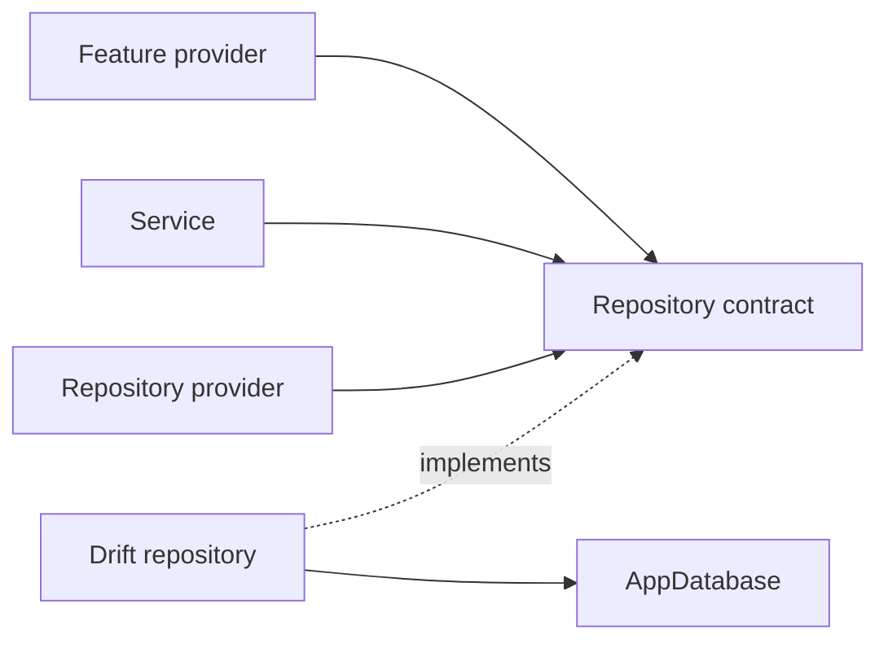

# Repository Pattern

## Status

The repository layer is partially implemented. VinylApp-013 introduces
`IAlbumRepository`, `AlbumRepository`, and `albumRepositoryProvider`.
ArtistRepository and PlayRepository remain planned.

## Purpose

Repositories keep Drift query details out of feature providers, services, and
widgets. They expose persistence operations using application language rather
than raw SQL or generated query builders.



## VinylApp-013 — AlbumRepository

Implemented in `lib/repositories/album_repository.dart`.

### Contract

`IAlbumRepository` exposes:

- `findAll()`
- `findById(String id)`
- `create(AlbumsCompanion album)`
- `update(Album album)`
- `delete(String id)`
- `search(String query)`

### Drift implementation

`AlbumRepository` receives `AppDatabase` through its constructor and owns all
Album persistence queries.

`search(query)`:

- trims and lowercases the search text;
- returns all albums for a blank query;
- joins Albums to Artists;
- matches album title case-insensitively;
- matches artist name case-insensitively;
- returns Album rows rather than exposing the Drift join to callers.

### Provider

VinylApp-013 also introduces:

```text
albumRepositoryProvider
```

The provider exposes the repository through its interface and obtains
`AppDatabase` from `databaseProvider`.

## Remaining Trello tasks

### VinylApp-014 — ArtistRepository

Planned operations:

- `findOrCreate(name)` with case-insensitive deduplication
- `findById()`
- `findAll()`

### VinylApp-015 — PlayRepository

Planned operations:

- `create()`
- `findByAlbum(albumId)`
- `findAll()`
- `deleteById()`
- `getPlayCountByAlbum()`
- `getRecentlyPlayed(limit)`

### VinylApp-016 — Repository providers

VinylApp-016 remains the dedicated task for completing and standardizing the
repository-provider layer. Because VinylApp-013 already introduces
`albumRepositoryProvider`, 016 should add the remaining providers and verify a
consistent override/testing pattern instead of duplicating the Album provider.

## Rules

- Feature UI does not issue Drift queries directly once a repository owns the
  persistence operation.
- Repositories return domain-friendly results, not query builders.
- Repository implementations receive `AppDatabase` through dependency
  injection.
- Repository providers must remain overrideable in tests.
- Aggregation queries belong in repositories when they are fundamentally data
  access.
- Interpretation and multi-step orchestration belong in services.
- Repository methods receive focused tests against an in-memory database.

## Testing

`test/repositories/album_repository_test.dart` covers:

- create;
- find all;
- find by ID, including missing rows;
- update;
- delete;
- title search case-insensitively;
- artist-name search case-insensitively;
- blank-query behavior.

## Collection requirement

VinylApp-018 eventually needs album data joined with artist information and
play-derived values. The screen should consume provider-facing state rather than
issue joins or aggregation queries itself.
