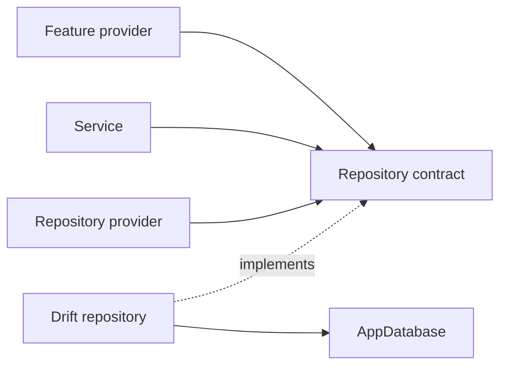

# Repository Pattern

## Status

The repository layer includes Album, Artist, Play, and NFC-tag persistence
boundaries. VinylApp-013 introduced AlbumRepository, VinylApp-014 added
ArtistRepository, VinylApp-015 added PlayRepository, and the VinylApp-041 change
set adds NfcTagRepository on top of the VinylApp-040 NFC schema.

## Purpose

Repositories keep Drift query details out of feature providers, services, and
widgets. They expose persistence operations using application language rather
than raw SQL, generated query builders, or Drift companion construction.



## Creation contract rule

Repositories own persistence-only creation details:

- generated entity IDs;
- `createdAt` timestamps;
- conversion of `DateTime` values to the database representation;
- Drift `Companion` construction;
- insert execution.

Callers should not need to import Drift just to create an Album or Play. This is
important for the upcoming PlayLoggingService and for fake repositories in
service/provider tests.

### AlbumRepository

`IAlbumRepository` exposes:

- `findAll()`
- `findById(String id)`
- `create(...)` with application-facing album fields
- `update(Album album)`
- `delete(String id)`
- `search(String query)`

`create()` trims required text, generates the album ID and creation timestamp,
constructs `AlbumsCompanion` internally, and returns the inserted `Album`.

`search(query)` trims and lowercases search text, joins Albums to Artists, and
matches both album title and artist name case-insensitively.

### ArtistRepository

`IArtistRepository` exposes:

- `findOrCreate(String name)`
- `findById(String id)`
- `findAll()`

`findOrCreate(name)` trims the name and performs case-insensitive deduplication
inside a transaction. The repository owns ID/timestamp creation for new artists.

### PlayRepository

`IPlayRepository` exposes:

- `create(albumId:, playedAt:, sidePlayed:)`
- `findByAlbum(String albumId)`
- `findAll()`
- `deleteById(String id)`
- `getPlayCountByAlbum(String albumId)`
- `getRecentlyPlayed(int limit)`

`create()` owns the play ID, creation timestamp, ISO-8601 conversion, and
`PlaysCompanion` construction, then returns the inserted `Play`.

`getPlayCountByAlbum()` uses SQL `COUNT()`. `getRecentlyPlayed(limit)` uses
SQL `GROUP BY` plus `MAX(playedAt)` and applies the limit before loading the
matching Album rows, so it does not load the entire play-history table into
Dart.

### NfcTagRepository

`INfcTagRepository` exposes:

- `create(albumId:, nfcTagId:, writtenAt:)`
- `findByTagId(String nfcTagId)`
- `findByAlbum(String albumId)`
- `delete(String id)`

`create()` owns the association ID, UTC write timestamp, and
`NfcTagsCompanion` construction. `findByTagId()` and `findByAlbum()` return null
when no association exists. VinylApp-040 enforces the one-album/one-tag rule at
the database level.

## Repository providers

The current repository providers are:

```text
albumRepositoryProvider
artistRepositoryProvider
playRepositoryProvider
nfcTagRepositoryProvider
```

VinylApp-041 introduces `nfcTagRepositoryProvider`. VinylApp-016 then standardizes
the four repository dependencies and verifies they can be overridden through a
`ProviderContainer` without direct Drift access from feature providers.

## Ordering

Repository methods without an explicit ordering contract should not be assumed
to return insertion order. Collection-specific title, date, play-count, and
recent-play ordering belongs in the query/provider that actually defines that
user-facing behavior.

## Rules

- Feature UI does not issue Drift queries directly once a repository owns the
  persistence operation.
- Repositories return application-friendly results, not query builders.
- Repository creation APIs do not expose Drift companions to callers.
- Repository implementations receive `AppDatabase` through dependency
  injection.
- Repository providers remain overrideable in tests.
- Aggregation queries belong in repositories when they are fundamentally data
  access.
- Interpretation and multi-step orchestration belong in services.
- Repository methods receive focused tests against an in-memory database.
