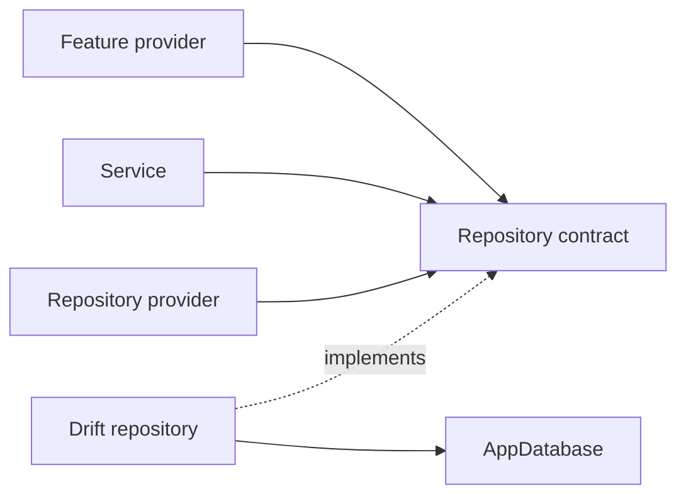

# Repository Pattern

## Status

The repository layer now includes the core Album, Artist, and Play persistence
boundaries. VinylApp-013 introduces `IAlbumRepository`, `AlbumRepository`, and
`albumRepositoryProvider`; VinylApp-014 adds the Artist equivalents; and
VinylApp-015 adds `IPlayRepository`, `PlayRepository`, and
`playRepositoryProvider`.

## Purpose

Repositories keep Drift query details out of feature providers, services, and
widgets. They expose persistence operations using application language rather
than raw SQL or generated query builders.



## VinylApp-013 — AlbumRepository

Implemented in `lib/repositories/album_repository.dart`.

### Contract

`IAlbumRepository` exposes:

- `findAll()`
- `findById(String id)`
- `create(AlbumsCompanion album)`
- `update(Album album)`
- `delete(String id)`
- `search(String query)`

### Drift implementation

`AlbumRepository` receives `AppDatabase` through its constructor and owns all
Album persistence queries.

`search(query)`:

- trims and lowercases the search text;
- returns all albums for a blank query;
- joins Albums to Artists;
- matches album title case-insensitively;
- matches artist name case-insensitively;
- returns Album rows rather than exposing the Drift join to callers.

### Provider

VinylApp-013 also introduces:

```text
albumRepositoryProvider
```

The provider exposes the repository through its interface and obtains
`AppDatabase` from `databaseProvider`.

## VinylApp-014 — ArtistRepository

Implemented in `lib/repositories/artist_repository.dart`.

### Contract

`IArtistRepository` exposes:

- `findOrCreate(String name)`
- `findById(String id)`
- `findAll()`

### Drift implementation

`ArtistRepository` receives `AppDatabase` through its constructor.
`findOrCreate(name)` trims the supplied name, looks for an existing artist using
a case-insensitive match, and returns that row when found. If no match exists,
it inserts and returns a new Artist. The lookup-and-create sequence runs inside
a Drift transaction so one repository call is atomic on the database connection.

Blank names are rejected rather than persisted as empty artists.

### Provider

VinylApp-014 introduces:

```text
artistRepositoryProvider
```

The provider exposes the repository through `IArtistRepository` and obtains
`AppDatabase` from `databaseProvider`.

## Remaining Trello tasks

### VinylApp-015 — PlayRepository

Implemented in `lib/repositories/play_repository.dart`.

#### Contract

`IPlayRepository` exposes:

- `create(PlaysCompanion play)`
- `findByAlbum(String albumId)`
- `findAll()`
- `deleteById(String id)`
- `getPlayCountByAlbum(String albumId)`
- `getRecentlyPlayed(int limit)`

#### Drift implementation

`PlayRepository` receives `AppDatabase` through its constructor and owns play
history queries. `findByAlbum()` returns the selected album's plays newest first.
`getPlayCountByAlbum()` uses a Drift count aggregate and returns zero when no
plays exist. `getRecentlyPlayed(limit)` walks play history newest-first, keeps one
entry per album, loads those Album rows, and restores recency order after the
`IN` query. Non-positive limits return an empty list.

The v1 schema stores `playedAt` as normalized ISO-8601 text, so repository tests
write timestamps in a consistent sortable representation.

#### Provider

VinylApp-015 introduces:

```text
playRepositoryProvider
```

The provider exposes the repository through `IPlayRepository` and obtains
`AppDatabase` from `databaseProvider`.

### VinylApp-016 — Repository providers

VinylApp-016 remains the dedicated task for completing and standardizing the
repository-provider layer. Because VinylApp-013 through VinylApp-015 already introduce
`albumRepositoryProvider`, `artistRepositoryProvider`, and `playRepositoryProvider`,
016 should add the remaining provider(s) and verify a consistent override/testing
pattern instead of duplicating existing providers.

## Rules

- Feature UI does not issue Drift queries directly once a repository owns the
  persistence operation.
- Repositories return domain-friendly results, not query builders.
- Repository implementations receive `AppDatabase` through dependency
  injection.
- Repository providers must remain overrideable in tests.
- Aggregation queries belong in repositories when they are fundamentally data
  access.
- Interpretation and multi-step orchestration belong in services.
- Repository methods receive focused tests against an in-memory database.

## Testing

`test/repositories/album_repository_test.dart` covers:

- create;
- find all;
- find by ID, including missing rows;
- update;
- delete;
- title search case-insensitively;
- artist-name search case-insensitively;
- blank-query behavior.

`test/repositories/artist_repository_test.dart` covers:

- creating a new artist;
- case-insensitive idempotent `findOrCreate()` behavior;
- whitespace normalization;
- blank-name rejection;
- find by ID, including missing rows;
- find all.

`test/repositories/play_repository_test.dart` covers:

- play creation and persisted fields;
- per-album filtering with newest-first ordering;
- all-play retrieval;
- targeted deletion;
- per-album play counts, including zero;
- distinct recently played albums, recency ordering, and limits;
- `SidePlayed` round-trips for `full`, `sideA`, and `sideB`.

## Collection requirement

VinylApp-018 eventually needs album data joined with artist information and
play-derived values. The screen should consume provider-facing state rather than
issue joins or aggregation queries itself.
