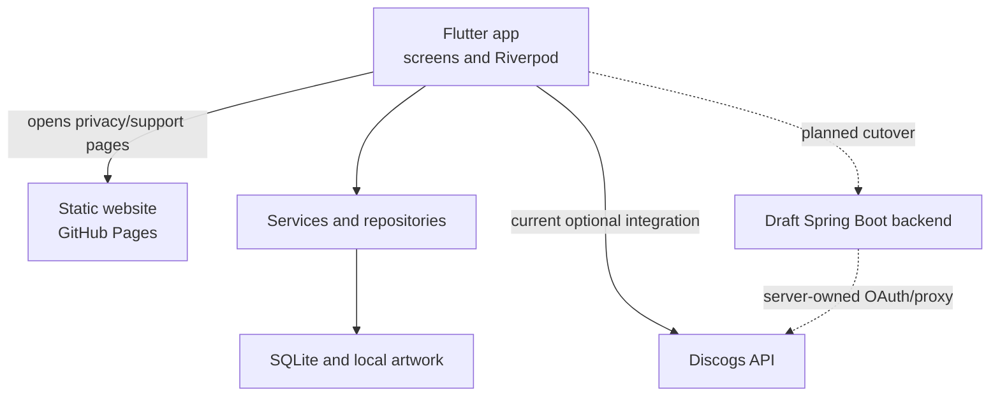
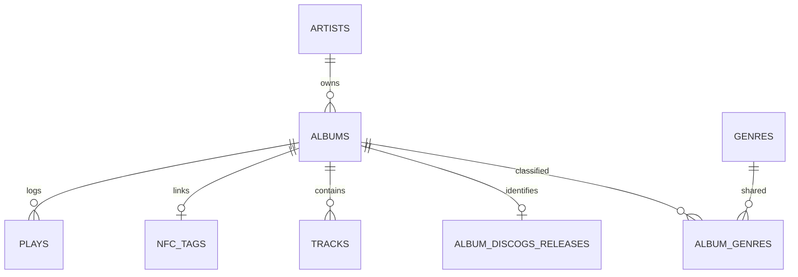

# Groovefolio developer guide

An onboarding guide for the Android app, public website, and proposed Discogs backend. Verified against the three repositories on September 23, 2026. Read the status notes before following a deployment step: a passing draft PR is not a running service.

## 1. Overview

Groovefolio helps someone catalog their vinyl records and remember what they played. The Android app stores records, artists, genres, tracklists, artwork, listening history, NFC tag links, statistics, and recommendations on the phone. It works without a Groovefolio account or a server. A Discogs connection can optionally look up pressings by title or barcode, fill in record details, and import a user's Discogs collection.

The [public website](https://groovefolio.app/) introduces the app, shows screenshots, and hosts [privacy](https://groovefolio.app/privacy/) and [support](https://groovefolio.app/support/) pages. It is a static marketing site, not a web version of the collection. The [backend repository](https://github.com/hunter-goller/Groovefolio-Backend) contains a **draft, unmerged, undeployed** Java service intended to keep Discogs credentials off distributed app builds. Today's app still talks to Discogs directly with build-time application credentials. Neither the backend nor the website stores a user's local record collection.

**Current status:** The [app](https://github.com/hunter-goller/Groovefolio) and [website](https://github.com/hunter-goller/Groovefolio-Site) have merged code; the app has not had a public Play Store release. The backend's six dependent draft PRs [#5](https://github.com/hunter-goller/Groovefolio-Backend/pull/5) through [#10](https://github.com/hunter-goller/Groovefolio-Backend/pull/10) form an implementation stack, while backend `main` contains only a placeholder README. Backend commands below require the branch at the tip of that stack and are for local staging, not a production installation.

## 2. Architecture

“Local-first” means the phone's SQLite database is the source of truth. The UI asks Riverpod providers for state; services apply business rules; repositories read or write Drift tables. This separation keeps a change to, for example, the website or optional Discogs service from interrupting ordinary play logging.



The backend has a different database: PostgreSQL stores installation identity, request limits, encrypted Discogs connection credentials, and short-lived OAuth flow state. It is **not** a mirror of the phone's SQLite database. On a future cutover, the app will register an installation and use a bearer token for Discogs endpoints; local record and play writes will still happen on the phone. The website is independently deployed through GitHub Pages and has no API dependency.

## 3. Tech stack

| Part | Technology | Why it is here |
|---|---|---|
| App UI | Flutter and Dart (`pubspec.yaml`: Dart `^3.12.2`) | One mobile UI codebase; Android is the release target, with iOS groundwork. |
| App state/navigation | Riverpod with generated providers; `go_router` | Dependency injection and reactive screens; centralized named route paths. |
| App storage | Drift over SQLite; `path_provider`; local artwork files | Typed queries and migrations, with collection and plays available offline. |
| Device/integration | `flutter_nfc_kit`, `ndef`, native Android Kotlin, `mobile_scanner`, `app_links`, `flutter_secure_storage` | NFC writing/taps, barcode scanning, current Discogs OAuth callback, encrypted credential storage. |
| Website | HTML, CSS, JavaScript; Node 22 for checks; Playwright | Static site with small interactive feature panels and browser regression checks; no production JavaScript framework or build step. |
| Backend draft | Java 17, Spring Boot 4.1.1, Maven wrapper, PostgreSQL 17, Flyway, Docker Compose | Small bounded HTTP service for installation authorization and server-owned Discogs OAuth/proxy; migration-controlled server state. |
| Delivery | GitHub Actions; GitHub Pages for the site | App/backend checks run on PRs; a site push to `main` publishes the static site. Play upload remains a manual release process. |

Package names such as `vinyl_app`, historical `VinylApp-###` tickets, and the SQLite filename `vinyl_app_db.sqlite` predate the Groovefolio name. The permanent Android application ID is `app.groovefolio`.

## 4. Folder and file structure

Clone the repos side by side; these paths are relative to their respective roots.

| Repository / path | Responsibility |
|---|---|
| App `lib/main.dart`, `lib/routing/` | Startup, app shell, route definitions and navigation. |
| App `lib/features/` | Collection, record detail/add/edit, play logging, Stats, Discover, onboarding, Settings, NFC help, Discogs import UI. |
| App `lib/providers/` | Riverpod state and repository bindings consumed by widgets. |
| App `lib/services/` | Cross-repository operations: plays, record writes, artwork, deletion, recommendations, onboarding, Discogs and NFC. |
| App `lib/repositories/` | Query/write interfaces and Drift implementations. |
| App `lib/db/schema/`, `lib/db/migrations/`, `lib/db/app_database.dart` | Table definitions, frozen historical migration steps, database connection and migration runner. |
| App `android/app/src/main/`, `ios/` | Platform configuration; Android manifest, native NFC handling and signing. |
| App `test/`, `drift_schemas/`, `tools/verify_vinylapp_012.ps1` | Unit/widget/database tests, schema snapshots and local verification. |
| App `docs/`, `ROADMAP.md` | Detailed feature, architecture, setup, release and historical notes; this is the cross-repo entry point. |
| Site `index.html`, `styles.css`, `script.js` | Marketing content, layout and feature interactions. |
| Site `privacy/`, `support/`, `assets/` | Public policy and support pages, optimized screenshots and branding. |
| Site `tools/`, `.github/workflows/` | Link/asset checks, Playwright browser smoke test and Pages deployment. |
| Backend draft `src/main/java/com/groovefolio/backend/` | Installation, security and Discogs controllers, services, gateway and credential vault. |
| Backend draft `src/main/resources/application.yaml`, `db/migration/` | Config defaults and Flyway PostgreSQL migrations V1–V4. |
| Backend draft `docs/`, `pom.xml`, `Dockerfile`, `compose*.yaml`, `tools/configure_staging.py` | API contracts, staging guidance, dependencies, containers and local secret setup. |

The app's [documentation index](README.md) and each repository's own README contain narrower, regularly maintained instructions. Historical app patch notes in `docs/Patch_Notes/` and `docs/archive/` are records of past work, not the current setup procedure.

## 5. Setup and installation

### App: first local run

Install Git, the current stable Flutter SDK compatible with Dart `^3.12.2`, Android Studio/SDK, and an emulator or Android phone. Run `flutter doctor` to resolve toolchain issues. From a terminal (PowerShell syntax shown):

```powershell
git clone https://github.com/hunter-goller/Groovefolio.git
cd Groovefolio
flutter doctor
flutter pub get
dart run build_runner build --delete-conflicting-outputs
flutter run
```

The app can run its local collection without Discogs credentials. To test *live* Discogs integration, register a Discogs developer application with the current `groovefolio://discogs-auth` callback, then pass your own consumer key and secret privately to `flutter run` using `--dart-define=DISCOGS_CONSUMER_KEY=...` and `--dart-define=DISCOGS_CONSUMER_SECRET=...`. Do not commit credentials or put them in a shared command log. An emulator covers most UI work; use physical Android hardware for NFC and camera flows. Old installs under `com.huntergoller.vinyl_app` do not upgrade in place to `app.groovefolio` and do not carry their local data over.

Run `flutter test`, `flutter analyze`, and `dart format --output=none --set-exit-if-changed .`, or use the repository's `tools/verify_vinylapp_012.ps1` on PowerShell. Build and check generated code and Drift snapshots when changing providers or schema. The app PR workflow also builds debug and disposable-key release APKs and exercises native NFC tests; it does not publish either build.

### Website: first local run

```sh
git clone https://github.com/hunter-goller/Groovefolio-Site.git
cd Groovefolio-Site
python -m http.server 8080
```

Open `http://localhost:8080`. In a second terminal, run `node tools/check-site.mjs`, `node --check script.js`, and `node --check support/support.js`. For browser tests, install Node 22, then run `npm ci`, `npx playwright install chromium`, and `npm run test:browser`. `npm run check` runs the fast checks. The Python server only serves files; there is no website database, API key, or production build command.

### Backend: optional draft staging

Backend `main` cannot yet run the service. Clone the private repository with an account that has access and check out the tip draft branch. Install Java 17, Docker with Compose, and Python 3.10+; Windows development uses WSL with Docker integration. See the branch's [staging instructions](https://github.com/hunter-goller/Groovefolio-Backend/blob/VinylApp-125-staging-setup/docs/staging.md) before supplying real Discogs credentials.

```sh
git clone https://github.com/hunter-goller/Groovefolio-Backend.git
cd Groovefolio-Backend
git checkout VinylApp-125-staging-setup
mkdir -p secrets
chmod 700 secrets
openssl rand -hex 32 > secrets/db_password.txt
docker compose up --build -d
curl --fail http://127.0.0.1:8080/actuator/health/readiness
DB_PASSWORD="$(cat secrets/db_password.txt)" ./mvnw verify
```

These commands use **base Compose**, which leaves Discogs OAuth disabled. The private `secrets/` files are ignored by Git; do not copy their contents into commits, logs or chat. For real OAuth staging, follow `docs/staging.md`: `python3 tools/configure_staging.py` asks for an HTTPS callback origin and Discogs app credentials, then start with `docker compose -f compose.yaml -f compose.staging.yaml up --build -d`. Use an HTTPS address a browser/phone can reach; both Compose ports bind to loopback. Real provider login, Pi/ARM64 behavior and host deployment still require hands-on validation.

## 6. Environment variables and configuration

Configuration decides which external systems a process can reach; it is separate from the collection data itself.

| Where | Setting | Needed for / location |
|---|---|---|
| App build | `DISCOGS_CONSUMER_KEY`, `DISCOGS_CONSUMER_SECRET` | Optional live direct Discogs calls, passed as `--dart-define`; empty values still allow local app/testing. A distributed secret is not a production secret. |
| App runtime | OAuth access token/secret | Obtained after connecting and kept in `flutter_secure_storage`, not SQLite. |
| Android release build | `GROOVEFOLIO_UPLOAD_KEYSTORE`, `GROOVEFOLIO_UPLOAD_KEY_ALIAS`, `GROOVEFOLIO_UPLOAD_STORE_PASSWORD`, `GROOVEFOLIO_UPLOAD_KEY_PASSWORD` | Required to sign a real release AAB; set locally for the build. Never store the real key/passwords in GitHub. |
| Website | No runtime environment variables | GitHub Pages publishes static files; Node/Playwright dependencies are development-only. |
| Backend base | `DB_URL`, `DB_USER`, `DB_PASSWORD`, `PORT` | PostgreSQL connection and HTTP port; defaults/overrides in `application.yaml`, Compose and a local secret file. |
| Backend OAuth | `DISCOGS_ENABLED`, `DISCOGS_CONSUMER_KEY`, `DISCOGS_CONSUMER_SECRET`, `DISCOGS_CALLBACK_ORIGIN` | Enable only for configured staging/production HTTPS, via protected environment or Spring config-tree secrets. Disabled by default. |
| Backend credential vault | `DISCOGS_ACTIVE_KEY`, `DISCOGS_ENCRYPTION_KEY_V1` (and versioned successors) | Server-side AES-GCM key version and base64 32-byte key. Back up keys with the database; losing a needed key breaks existing connections. |

The backend Compose files mount secret files from `secrets/` into Spring's `configtree:/run/secrets/`; merely exporting shell variables does not populate all base Compose secrets. Never put the upload key, Discogs consumer secret, OAuth token, backend installation bearer token, or database password in the public website or Git repository. The app's Android backup rules disable automatic cloud/device transfer of local data.

## 7. Key workflows

**Manual record and play.** Add/edit screens collect album and artist details. `RecordWriteService` coordinates repository writes in a transaction; `ArtworkStorageService` manages the image file separately. `PlayLoggingService` checks the album and writes a timestamped play. Stats and Discover read local repositories; Discover ranks already-owned records with explainable signals from listening history. The walkthrough uses the real screens and can be replayed from Settings.

**Current Discogs lookup and import.** The connected user authorizes in a browser via OAuth 1.0a and returns through `groovefolio://discogs-auth`; the app stores access credentials securely. Search or barcode lookup yields candidate releases, and selecting an exact pressing fetches release metadata for editable autofill. Collection import pages through the user's Discogs folder, filters vinyl, reviews exact/possible duplicates, then writes selected records, tracklists and artwork locally. Failures for individual releases are summarized; systemic authentication/network/rate-limit failures stop the batch. See [Discogs details](integrations/discogs.md).

**NFC play logging.** Link/write an NFC tag for a local album; native Android intent handling also accepts a URI tap when the app is cold or running. The NFC service resolves the association, suppresses rapid repeat taps (five-second per-album guard), and uses the ordinary play-logging path. Foreground Undo and background confirmation/notification depend on delivery context. Test with a physical compatible tag and phone; UI/emulator tests cannot prove antenna or OS intent behavior. See [NFC behavior](features/nfc.md).

**Proposed backend connection.** A future Flutter change will automatically register an installation, securely keep its bearer token, start server-owned Discogs OAuth, open the authorization URL, poll its transaction, and call bounded search/release/collection endpoints. The backend stores encrypted credentials and installation state only. Collection review, deduplication and saved records stay on the device. That Flutter cutover has **not** happened; draft backend code passing simulated CI tests is not proof of live Discogs login.

**Website update.** Edit the static HTML/CSS/JS and screenshots, run fast and browser checks, review the PR at narrow/mobile widths, then merge to site `main` only when the public changes are approved. The site must describe the shipping app accurately; the Play button stays a coming-soon state until a real listing URL exists.

## 8. API endpoints

There is **no Groovefolio API in the shipping app** and the website has none. The current app calls Discogs directly through `lib/services/discogs/`. The following routes exist only on the backend draft branch, are not deployed, and require production HTTPS before use. Protected `/v1` routes accept `Authorization: Bearer <installation token>` except registration. Errors use safe JSON such as `{"code":"authentication_required"}`; rate limits return HTTP 429 and `Retry-After`. Full request/response schemas are in the draft [OpenAPI files](https://github.com/hunter-goller/Groovefolio-Backend/tree/VinylApp-125-staging-setup/docs).

| Method and route | Input → output / purpose |
|---|---|
| `GET /actuator/health`, `/liveness`, `/readiness` | No body → status such as `{"status":"UP"}`; readiness checks PostgreSQL and can return 503. No Discogs probe. |
| `POST /v1/installations` | Empty JSON `{}` → 201 with `installationId`, `expiresAt`, one-time `token`; bounded automatic registration. |
| `GET /v1/installation` | Bearer token → installation ID and expiry, never the token. |
| `POST /v1/installation/rotate` | Bearer plus `{"nextToken":"..."}` → new expiry/ID; successor must already be saved securely by the client. |
| `DELETE /v1/installation` | Bearer → 204; revokes token and its Discogs connection/flow. |
| `POST /v1/discogs/connections` | Bearer, no body → 201 with `transactionId`, `expiresAt`, Discogs `authorizationUrl`. |
| `GET` / `DELETE /v1/discogs/connections/{transactionId}` | Bearer → poll `pending/connected/canceled/expired/failed`, or cancel pending flow (204). |
| `GET /oauth/discogs/callback/{state}` | Discogs browser callback with `oauth_token` and `oauth_verifier` → static completion page; no credentials returned. |
| `GET` / `DELETE /v1/discogs/account` | Bearer → connection state and verified identity, or delete server-held credentials (204). |
| `GET /v1/discogs/search?artist=...&title=...&page=1&perPage=5` | Connected bearer; at least one of artist/title → bounded vinyl release candidates with pagination. |
| `GET /v1/discogs/barcode/{barcode}?perPage=10` | Connected bearer and numeric barcode → page of vinyl candidates, with at most one UPC/EAN fallback. |
| `GET /v1/discogs/releases/{releaseId}` | Connected bearer and positive canonical release ID → title, artist, year, genres/styles, artwork URL and ordered tracks. |
| `GET /v1/discogs/collection?page=1&perPage=100` | Connected bearer → one page containing all formats and distinct physical instances; app filters/reviews/saves vinyl locally. |

For example, release lookup returns selected fields rather than arbitrary upstream Discogs JSON: `{"releaseId":123,"title":"Example","artist":"Artist","year":1971,"label":"Label","genres":["Rock"],"styles":[],"artworkUrl":null,"tracks":[{"title":"Song","sequence":0,"position":"A1","side":"A","durationSeconds":185}]}`. The catalog endpoints use a shared request budget; large future imports must respect `Retry-After` and offer cancellation.

## 9. Database and data model

The **phone's SQLite** schema is at version 6. IDs are primarily text UUIDs; timestamps in app tables are stored as text. The central relationships are:



| Table | Important fields / rule |
|---|---|
| `artists` | ID, name, created time; referenced by albums. |
| `albums` | ID, title, artist ID, optional year/label/artwork path/purchase date/price, created time. |
| `plays` | ID, album ID, played time, side played, created time; album delete cascades; `(album_id, played_at)` index. |
| `nfc_tags` | ID, unique album ID, unique physical tag ID, written time; one-to-one link, cascade on album delete. |
| `genres`, `album_genres` | Shared case-insensitive genre names; composite album/genre join key, cascade cleanup. |
| `album_discogs_releases` | One exact release ID per album, with globally unique release ID in this local DB; cascade on album delete. |
| `tracks` | Album ID, ordered sequence, title and optional position/side/duration; cascade on album delete. |

See [database architecture](architecture/database.md) and `lib/db/schema/` for exact Drift definitions. Migrations v1–v6 are historical and frozen. Add a new version and schema snapshot for a physical schema change; test both fresh install and upgrade from an older database. Migration operations and `user_version` commit together, so a failed upgrade can retry without a half-applied version. Artwork is a local file referenced by path, not a SQLite blob.

The **draft server's PostgreSQL** V1–V4 migrations contain `installations` (UUID, hashed bearer token, expiry/revocation), shared and peer registration counters, `discogs_connections` (one encrypted credential envelope and verified identity per installation), `discogs_flows` (single-use OAuth state and encrypted temporary request credentials), and OAuth/catalog limit counters. Foreign keys cascade from installation to connection/flow. The server has no albums, plays, NFC mappings or artwork table. Its Flyway migrations run at startup; do not edit an already-applied migration in a shared database.

## 10. Deployment process

**App:** Open a PR to app `main` and let GitHub Actions run formatting, analysis, Flutter tests, Drift snapshot check, debug build, NFC unit tests and a disposable-key release compilation. Review on a phone for device-specific changes. A public Play release has **not** happened. For the first upload, create and back up the real upload keystore on the developer's computer, set the four signing variables, run `flutter build appbundle --release`, check its certificate against Play Console, and upload through the chosen test/release track. Follow [Android release signing](development/android-release-signing.md) and [Play readiness](development/google-play-readiness.md). CI's temporary key must never be used for Play.

**Website:** PR checks validate assets, links, JavaScript and browser behavior. A push/merge to site `main` invokes `.github/workflows/pages.yml`, which uploads the repository's static files and deploys GitHub Pages at `groovefolio.app`. This publishes public copy immediately; confirm privacy/support/marketing claims and the real Play link first. `sitemap.xml` currently includes home, privacy and support.

**Backend:** There is no deployed backend or production deployment workflow. Review the dependent draft PRs in stack order, then validate with a live Discogs developer app, HTTPS callback, authenticated catalog calls, database restart, and representative host capacity/backup tests. `docs/staging.md` gives disposable staging setup and teardown. Only after that should the Flutter integration and final hosting/cutover be built and reviewed. Do not assume a Docker image build in CI means the backend is live.

## 11. Common issues and debugging tips

| Symptom | First checks |
|---|---|
| Flutter import/provider types missing | `flutter pub get`, then `dart run build_runner build --delete-conflicting-outputs`; do not hand-edit generated `*.g.dart`. |
| Local DB upgrade fails | Check `lib/db/migrations/`, current schema version and `test/db/migration_recovery_test.dart`; preserve a failing database copy and user data. Do not reset it as a first fix. |
| Record appears missing after changing application ID | Check whether the old app was installed as `com.huntergoller.vinyl_app`; Android treats it separately from `app.groovefolio`. Automatic backup/transfer is disabled. |
| Discogs connect/search fails in current app | Check development defines, registered `groovefolio://discogs-auth` callback, network, secure-storage state and typed auth/rate-limit errors. Confirm manual collection still works offline. |
| NFC tap does nothing or double-logs | Check tag association, NFC enabled state, Android manifest/intent entry, foreground vs background delivery and five-second guard. Reproduce on a real phone/tag; inspect native Kotlin and `lib/services/nfc/`. |
| Site looks right locally but CI fails | Run `npm run check` and `npm run test:browser`; check missing asset/anchor, mobile navigation, dialog focus, JavaScript-off fallback and reduced motion. |
| Backend readiness is 503 | PostgreSQL health, secret file/`DB_PASSWORD` match, connection URL and Flyway logs; liveness may remain 200 while DB is down. Do not expose database port publicly. |
| Backend OAuth start is 503 | Base Compose disables Discogs on purpose; check staging override, HTTPS origin, mounted secret files and Spring config-tree settings. Never log callback query strings or bearer headers. |
| Backend 401/409/429 during catalog use | Respect token expiry/rotation and connection ownership; reconnect if credentials are invalid; read bounded `Retry-After` for shared request caps. Do not interpret a throttled import as completed. |

## 12. Future development notes

1. **Preserve the local-first boundary.** Keep offline CRUD, plays, Stats and Discover independent of the backend; an optional network feature must degrade cleanly. Avoid putting collection rows or listening history in the backend without a deliberate product/data-model change.
2. **Finish release dependencies in the right order.** The real upload key and signed AAB, listing/screenshots, permissions and Data Safety review, Play account/internal testing, phone NFC checks, and a production Discogs credential decision remain. Backend staging and Flutter cutover are separate tasks; the server work is still a draft stack. See [Play readiness](development/google-play-readiness.md).
3. **Protect data and credentials.** Local backup is currently disabled; reinstalling or moving phones does not restore records. A future export/restore needs versioned, consistent data plus artwork and must exclude OAuth/bearer secrets. Do not ship a consumer secret assuming a compiled mobile binary hides it.
4. **Change schemas and contracts deliberately.** Freeze prior Drift/Flyway migrations, add new ones, update tests/snapshots, and keep the app's direct Discogs models aligned with the backend DTOs during any cutover. The backend's per-minute catalog cap can interrupt a multi-page import; plan waiting, cancellation and retry behavior before switching clients.
5. **Treat UI and policy copy as release artifacts.** Verify website claims, screenshots, privacy/support links and Data Safety against the actual shipping build. Update the site CTA only when a real Play listing URL exists. Broad accessibility work and side-by-side listening breakdown are deferred beyond the first release, but maintain readable UI and reduced-motion behavior now.

For the current task list use [ROADMAP.md](../ROADMAP.md); for implementation details use the app [documentation index](README.md), the site [README](https://github.com/hunter-goller/Groovefolio-Site/blob/main/README.md), and the backend's [draft API/staging docs](https://github.com/hunter-goller/Groovefolio-Backend/tree/VinylApp-125-staging-setup/docs). Recheck PR, CI, hosting and Play Console state before calling any draft feature released.
