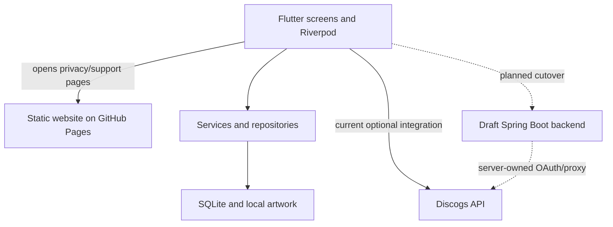
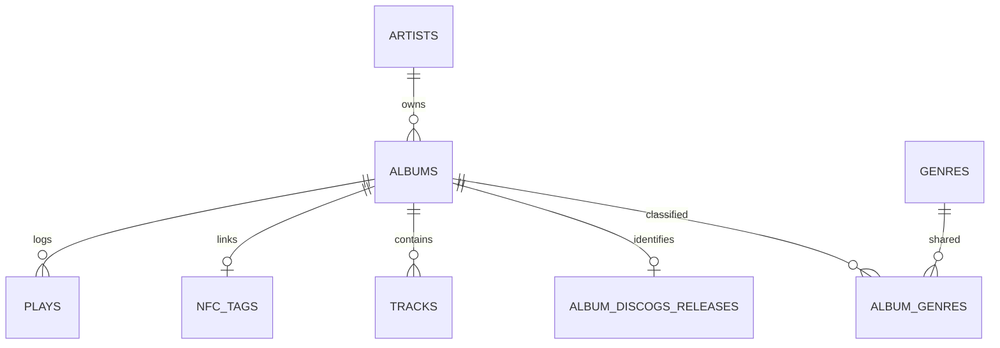

# Groovefolio developer guide

An onboarding guide for the Android app, public website, and proposed Discogs backend. Verified against the three repositories on September 23, 2026. Read the status notes before following a deployment step: a passing draft PR is not a running service.

## How to use this guide

Start with the question you are trying to answer. You do not need to read the whole document to fix one feature.

| Your goal | Start here | Then use |
|---|---|---|
| Understand the project for the first time | [Overview](#1-overview) and [architecture](#2-architecture) | [First-hour reading path](#first-hour-reading-path) |
| Run it on your computer | [Setup](#5-setup-and-installation) | [Configuration](#6-environment-variables-and-configuration) |
| Find the code for a screen or behavior | [Feature-to-code map](#feature-to-code-map) | [Workflows](#7-key-workflows) |
| Fix a crash, failed save, or wrong total | [Debugging checklist](#debugging-checklist) | [Symptom-to-code map](#symptom-to-code-map) |
| Fix a screen that shows old data | [Provider refreshes](#provider-refreshes) | [Worked debugging example](#worked-debugging-example) |
| Add a field, screen, or behavior | [Feature recipes](#feature-recipes) | [Verification commands](#verification-commands) |
| Change storage without losing records | [Migration procedure](#migration-procedure) | [Database recovery](#database-recovery) |
| Prepare a release | [Deployment](#10-deployment-process) | [Release process](development/release-process.md) |

### Contents

1. [Overview](#1-overview)
2. [Architecture and vocabulary](#2-architecture)
3. [Tech stack](#3-tech-stack)
4. [Folder/file structure and source map](#4-folder-and-file-structure)
5. [Setup, daily development, and verification](#5-setup-and-installation)
6. [Environment variables, config, and stored state](#6-environment-variables-and-configuration)
7. [End-to-end workflows and failure boundaries](#7-key-workflows)
8. [API endpoints and response contracts](#8-api-endpoints)
9. [Database/data model and migrations](#9-database-and-data-model)
10. [Deployment, release, and rollback considerations](#10-deployment-process)
11. [Common issues, debugging, and recovery](#11-common-issues-and-debugging-tips)
12. [Feature recipes and future maintenance](#12-future-development-notes)

Use your editor's **Go to definition** on the symbol names in this guide. Use `Ctrl+F` for the screen, service, or error you recognize. Links point to files rather than line numbers because lines move as code evolves.

**Source checkpoint:** app documentation baseline at `35d753e` (with the error-recovery changes documented in this PR), website `main` at `2a70c02`, and the backend draft stack at `c39dbbf`. This guide describes that code, not unseen Play Console settings or a verified production backend. The backend branch is currently `VinylApp-125-staging-setup`; once that stack merges, update its links and setup instructions here. Commands are intended for your own checkout. This documentation review did not run a live Discogs login, create a real upload key, or deploy a server.

## 1. Overview

Groovefolio helps someone catalog their vinyl records and remember what they played. The Android app stores records, artists, genres, tracklists, artwork, listening history, NFC tag links, statistics, and recommendations on the phone. It works without a Groovefolio account or a server. A Discogs connection can optionally look up pressings by title or barcode, fill in record details, and import a user's Discogs collection.

The [public website](https://groovefolio.app/) introduces the app, shows screenshots, and hosts [privacy](https://groovefolio.app/privacy/) and [support](https://groovefolio.app/support/) pages. It is a static marketing site, not a web version of the collection. The [backend repository](https://github.com/hunter-goller/Groovefolio-Backend) contains a **draft, unmerged, undeployed** Java service intended to keep Discogs credentials off distributed app builds. Today's app still talks to Discogs directly with build-time application credentials. Neither the backend nor the website stores a user's local record collection.

**Current status:** The [app](https://github.com/hunter-goller/Groovefolio) and [website](https://github.com/hunter-goller/Groovefolio-Site) have merged code; the app has not had a public Play Store release. The backend's six dependent draft PRs [#5](https://github.com/hunter-goller/Groovefolio-Backend/pull/5) through [#10](https://github.com/hunter-goller/Groovefolio-Backend/pull/10) form an implementation stack, while backend `main` contains only a placeholder README. Backend commands below require the branch at the tip of that stack and are for local staging, not a production installation.

## 2. Architecture

“Local-first” means the phone's SQLite database is the source of truth. The UI asks Riverpod providers for state; services apply business rules; repositories read or write Drift tables. This separation keeps a change to, for example, the website or optional Discogs service from interrupting ordinary play logging.



The backend has a different database: PostgreSQL stores installation identity, request limits, encrypted Discogs connection credentials, and short-lived OAuth flow state. It is **not** a mirror of the phone's SQLite database. On a future cutover, the app will register an installation and use a bearer token for Discogs endpoints; local record and play writes will still happen on the phone. The website is independently deployed through GitHub Pages and has no API dependency.

### Vocabulary used in the code

| Term | Plain-language meaning | Groovefolio example |
|---|---|---|
| Widget / screen | A piece of UI / a full page built from pieces | `CollectionScreen`, `AlbumListTile` |
| Provider | A named way to obtain a dependency or cached state; it can notify listening widgets | `albumRepositoryProvider`, `albumsProvider` |
| Service | The steps and rules for a user operation | `RecordWriteService` saves album metadata across tables |
| Repository | The boundary that reads/writes stored rows | `PlayRepository` creates play IDs and UTC timestamps |
| Model / DTO | A typed container of values passed between layers | `CollectionAlbum` joins display information; `DiscogsReleaseDetails` represents external metadata |
| Migration | A numbered, repeatable upgrade path from an older database layout | v6 adds cascade deletion and a play-history index |
| Transaction | Related database changes either all commit or all roll back | Album, artist, genres, release link, and tracks in one record creation |
| Invalidation | Discarding a cached provider result so consumers get a fresh read | `ref.invalidate(albumDetailProvider(albumId))` after a play |
| Generated code | Files built from annotations and schema definitions | Drift row/companion types and Riverpod `*.g.dart` providers |
| OAuth | A user authorizes Discogs access in their browser without giving Groovefolio their password | Current app callback to `groovefolio://discogs-auth` |

`ref.watch` subscribes to a provider's state/dependency changes. `ref.read` obtains its current value without creating that subscription. Neither means “watch every SQLite write.” Most data providers here use one-time repository reads. See [provider refreshes](#provider-refreshes).

### Startup and lifetime

1. [`main()`](../lib/main.dart) initializes Flutter and starts [`AppStartup`](../lib/features/startup/app_startup.dart), which owns loading/error/retry UI. Each initialization attempt creates a fresh `ProviderContainer` (the dependency/state container).
2. It instantiates `AppLinks` before opening the database, so an incoming OAuth/NFC link is retained during startup.
3. [`AppDatabase.initialize()`](../lib/db/app_database.dart) forces the lazy database connection to open and finish migrations. A failure disposes that attempt’s container and shows a retry screen. Retry opens a fresh connection without clearing data or bypassing migrations. The native splash is removed after Flutter paints its loading/recovery UI.
4. The root `UncontrolledProviderScope` shares that same container with `MyApp`; the database provider stays alive for the container's lifetime and closes on disposal.
5. `routerProvider` selects screens. Its `ShellRoute` wraps them with `WalkthroughFrame`; the normal Collection entry uses `OnboardingGate`.
6. Root listeners classify the shared app-link stream. OAuth callbacks go through the authorization controller; album NFC URIs go through `NfcIntentPlayHandler`. Notification-open navigation is separate from play insertion.

### Choosing the right layer

| Change | Put it here | Keep in mind |
|---|---|---|
| Text, spacing, icons, loading/empty/error UI | Screen/widget and `lib/theme/` | Keep existing semantics, text scaling and reduced-motion behavior. |
| Form state, button enablement, transient selection | Screen state or a feature controller | Keep transient choices separate from durable database fields. |
| Rules involving several stored objects | Service | Use the shared transaction runner when database writes must be atomic. |
| SQL, IDs, timestamps, persistence normalization | Repository | UI/services supply domain values, not Drift companions. |
| New stored column/table | Schema, new migration, repositories, then callers | Generated types and all full-row reconstructions must be updated. |
| External response parsing/authentication/retry | Integration service/client | Map external JSON into bounded typed models before UI consumes it. |
| Android intent delivery or OS feedback | Native Kotlin plus Dart platform adapter | Validate both sides of method-channel names and payloads. |

## 3. Tech stack

| Part | Technology | Why it is here |
|---|---|---|
| App UI | Flutter and Dart (`pubspec.yaml`: Dart `^3.12.2`) | One mobile UI codebase; Android is the release target, with iOS groundwork. |
| App state/navigation | Riverpod with generated providers; `go_router` | Dependency injection and reactive screens; centralized named route paths. |
| App storage | Drift over SQLite; `path_provider`; local artwork files | Typed queries and migrations, with collection and plays available offline. |
| Device/integration | `flutter_nfc_kit`, `ndef`, native Android Kotlin, `mobile_scanner`, `app_links`, `flutter_secure_storage` | NFC writing/taps, barcode scanning, current Discogs OAuth callback, encrypted credential storage. |
| Website | HTML, CSS, JavaScript; Node 22 for checks; Playwright | Static site with small interactive feature panels and browser regression checks; no production JavaScript framework or build step. |
| Backend draft | Java 17, Spring Boot 4.1.1, Maven wrapper, PostgreSQL 17, Flyway, Docker Compose | Small bounded HTTP service for installation authorization and server-owned Discogs OAuth/proxy; migration-controlled server state. |
| Delivery | GitHub Actions; GitHub Pages for the site | App/backend checks run on PRs; a site push to `main` publishes the static site. Play upload remains a manual release process. |

Package names such as `vinyl_app`, historical `VinylApp-###` tickets, and the SQLite filename `vinyl_app_db.sqlite` predate the Groovefolio name. The permanent Android application ID is `app.groovefolio`.

## 4. Folder and file structure

Clone the repos side by side; these paths are relative to their respective roots.

| Repository / path | Responsibility |
|---|---|
| App `lib/main.dart`, `lib/routing/` | Startup, app shell, route definitions and navigation. |
| App `lib/features/` | Collection, record detail/add/edit, play logging, Stats, Discover, onboarding, Settings, NFC help, Discogs import UI. |
| App `lib/providers/` | Riverpod state and repository bindings consumed by widgets. |
| App `lib/services/` | Cross-repository operations: plays, record writes, artwork, deletion, recommendations, onboarding, Discogs and NFC. |
| App `lib/repositories/` | Query/write interfaces and Drift implementations. |
| App `lib/db/schema/`, `lib/db/migrations/`, `lib/db/app_database.dart` | Table definitions, frozen historical migration steps, database connection and migration runner. |
| App `android/app/src/main/`, `ios/` | Platform configuration; Android manifest, native NFC handling and signing. |
| App `test/`, `drift_schemas/`, `tools/verify_vinylapp_012.ps1` | Unit/widget/database tests, schema snapshots and local verification. |
| App `docs/`, `ROADMAP.md` | Detailed feature, architecture, setup, release and historical notes; this is the cross-repo entry point. |
| Site `index.html`, `styles.css`, `script.js` | Marketing content, layout and feature interactions. |
| Site `privacy/`, `support/`, `assets/` | Public policy and support pages, optimized screenshots and branding. |
| Site `tools/`, `.github/workflows/` | Link/asset checks, Playwright browser smoke test and Pages deployment. |
| Backend draft `src/main/java/com/groovefolio/backend/` | Installation, security and Discogs controllers, services, gateway and credential vault. |
| Backend draft `src/main/resources/application.yaml`, `db/migration/` | Config defaults and Flyway PostgreSQL migrations V1–V4. |
| Backend draft `docs/`, `pom.xml`, `Dockerfile`, `compose*.yaml`, `tools/configure_staging.py` | API contracts, staging guidance, dependencies, containers and local secret setup. |

The app's [documentation index](README.md) and each repository's own README contain narrower, regularly maintained instructions. Historical app patch notes in `docs/Patch_Notes/` and `docs/archive/` are records of past work, not the current setup procedure.

### Feature-to-code map

Open the first file, locate the named operation, then follow its provider/service calls. These tests are executable examples of intended behavior.

| Feature or failure area | Start in source | Existing test to read/run |
|---|---|---|
| Startup/migration | [`main.dart`](../lib/main.dart), [`AppDatabase`](../lib/db/app_database.dart) | [`migration_recovery_test.dart`](../test/db/migration_recovery_test.dart), [`migration_test.dart`](../test/db/migration_test.dart) |
| Collection search/sort | [`album_providers.dart`](../lib/providers/album_providers.dart), [`CollectionScreen`](../lib/features/albums/screens/collection_screen.dart) | [`album_providers_test.dart`](../test/providers/album_providers_test.dart), [`collection_screen_genres_test.dart`](../test/features/albums/collection_screen_genres_test.dart) |
| Add/Edit record | [`RecordWriteService`](../lib/services/record_write_service.dart), [`AddRecordScreen`](../lib/features/albums/screens/add_record_screen.dart), [`EditAlbumScreen`](../lib/features/albums/screens/edit_album_screen.dart) | [`record_write_service_test.dart`](../test/services/record_write_service_test.dart), [`edit_album_screen_test.dart`](../test/features/albums/edit_album_screen_test.dart) |
| Artwork save/replace | [`ArtworkStorageService`](../lib/services/artwork_storage_service.dart) and the Add/Edit callers | [`artwork_storage_service_test.dart`](../test/services/artwork_storage_service_test.dart), [`add_record_artwork_test.dart`](../test/features/albums/add_record_artwork_test.dart) |
| Delete record | [`confirmAndDeleteAlbum`](../lib/features/albums/album_delete_flow.dart), [`AlbumDeletionService`](../lib/services/album_deletion_service.dart) | [`album_deletion_service_test.dart`](../test/services/album_deletion_service_test.dart), [`album_delete_flow_test.dart`](../test/features/albums/album_delete_flow_test.dart) |
| Manual play / history | [`LogPlayScreen`](../lib/features/plays/screens/log_play_screen.dart), [`PlayLoggingService`](../lib/services/play_logging_service.dart), [`PlayRepository`](../lib/repositories/play_repository.dart) | [`play_logging_service_test.dart`](../test/services/play_logging_service_test.dart), [`log_play_screen_test.dart`](../test/features/plays/log_play_screen_test.dart) |
| Stats / Discover | [`StatsService`](../lib/services/stats_service.dart), [`RecommendationService`](../lib/services/recommendation_service.dart) | [`stats_service_filters_test.dart`](../test/services/stats_service_filters_test.dart), [`recommendation_service_test.dart`](../test/services/recommendation_service_test.dart) |
| Discogs connection | [`DiscogsAuthorizationController`](../lib/services/discogs/discogs_providers.dart), [`DiscogsAuthService`](../lib/services/discogs/discogs_auth_service.dart) | [`discogs_authorization_controller_test.dart`](../test/services/discogs/discogs_authorization_controller_test.dart) |
| Discogs HTTP/barcode/import | [`DiscogsApiClient`](../lib/services/discogs/discogs_api_client.dart), [`DiscogsCollectionImportService`](../lib/services/discogs/discogs_collection_import_service.dart) | [`discogs_api_client_test.dart`](../test/services/discogs/discogs_api_client_test.dart), [`discogs_barcode_search_test.dart`](../test/services/discogs/discogs_barcode_search_test.dart), [`discogs_collection_import_service_test.dart`](../test/services/discogs/discogs_collection_import_service_test.dart) |
| NFC write / scan / automatic play | [`NfcService`](../lib/services/nfc/nfc_service.dart), [`NfcIntentPlayHandler`](../lib/services/nfc/nfc_intent_play_handler.dart), [`NfcPlayLoggingService`](../lib/services/nfc/nfc_play_logging_service.dart) | [`nfc_service_test.dart`](../test/services/nfc_service_test.dart), [`nfc_intent_play_handler_test.dart`](../test/services/nfc_intent_play_handler_test.dart), [`nfc_play_logging_service_test.dart`](../test/services/nfc_play_logging_service_test.dart) |
| Onboarding/replay | [`OnboardingService`](../lib/services/onboarding_service.dart), [`WalkthroughController`](../lib/services/walkthrough_controller.dart), [`WalkthroughFrame`](../lib/features/onboarding/widgets/walkthrough_frame.dart) | [`onboarding_service_test.dart`](../test/services/onboarding_service_test.dart), [`onboarding_gate_test.dart`](../test/features/onboarding/onboarding_gate_test.dart) |
| Settings/theme/version | [`SettingsPreferences`](../lib/features/settings/widgets/settings_preferences.dart), [`ThemeModeController`](../lib/theme/theme_provider.dart), [`AppBuildInfo`](../lib/services/app_info_service.dart) | [`settings_preferences_test.dart`](../test/features/settings/settings_preferences_test.dart), [`app_info_service_test.dart`](../test/services/app_info_service_test.dart) |

Native NFC code lives under [`android/app/src/main/kotlin/app/groovefolio/`](../android/app/src/main/kotlin/app/groovefolio/): `NfcEntryActivity`, `NfcProcessingActivity`, `NfcIntentGate`, `NfcDeliveryTracker`, and `MainActivity`. Tests also verify the manifest and backup configuration under `test/platform/`.

### First-hour reading path

1. Run the app without Discogs, add one record and log one play. This gives you a concrete operation to trace.
2. Read `main.dart` and `routing/router.dart` to locate entry points.
3. Follow `AddRecordScreen._save` → `RecordWriteService.createRecord` → repositories → Drift schema. Then compare Edit's different artwork ordering.
4. Read `albumsProvider` and `albumDetailProvider`; notice how they load related rows and why invalidation matters.
5. Read the matching service and widget tests before changing that behavior.
6. Use a throwaway development collection for migration, reset, import and NFC experiments. Seed entry points share the normal app's database; they are not an isolated demo mode.

## 5. Setup and installation

### App: first local run

Install Git, the current stable Flutter SDK compatible with Dart `^3.12.2`, Android Studio/SDK, and an emulator or Android phone. Run `flutter doctor` to resolve toolchain issues. From a terminal (PowerShell syntax shown):

```powershell
git clone https://github.com/hunter-goller/Groovefolio.git
cd Groovefolio
flutter doctor
flutter pub get
dart run build_runner build --delete-conflicting-outputs
flutter run
```

The app can run its local collection without Discogs credentials. To test *live* Discogs integration, register a Discogs developer application with the current `groovefolio://discogs-auth` callback, then pass your own consumer key and secret privately to `flutter run` using `--dart-define=DISCOGS_CONSUMER_KEY=...` and `--dart-define=DISCOGS_CONSUMER_SECRET=...`. Do not commit credentials or put them in a shared command log. An emulator covers most UI work; use physical Android hardware for NFC and camera flows. Old installs under `com.huntergoller.vinyl_app` do not upgrade in place to `app.groovefolio` and do not carry their local data over.

Run `flutter test`, `flutter analyze`, and `dart format --output=none --set-exit-if-changed .`, or use the repository's `tools/verify_vinylapp_012.ps1` on PowerShell. Build and check generated code and Drift snapshots when changing providers or schema. The app PR workflow also builds debug and disposable-key release APKs and exercises native NFC tests; it does not publish either build.

### Website: first local run

```sh
git clone https://github.com/hunter-goller/Groovefolio-Site.git
cd Groovefolio-Site
python -m http.server 8080
```

Open `http://localhost:8080`. In a second terminal, run `node tools/check-site.mjs`, `node --check script.js`, and `node --check support/support.js`. For browser tests, install Node 22, then run `npm ci`, `npx playwright install chromium`, and `npm run test:browser`. `npm run check` runs the fast checks. The Python server only serves files; there is no website database, API key, or production build command.

### Backend: optional draft staging

Backend `main` cannot yet run the service. Clone the private repository with an account that has access and check out the tip draft branch. Install Java 17, Docker with Compose, OpenSSL, and Python 3.10+; Windows development uses WSL with Docker integration. See the branch's [staging instructions](https://github.com/hunter-goller/Groovefolio-Backend/blob/VinylApp-125-staging-setup/docs/staging.md) before supplying real Discogs credentials.

```sh
git clone https://github.com/hunter-goller/Groovefolio-Backend.git
cd Groovefolio-Backend
git checkout VinylApp-125-staging-setup
mkdir -p secrets
chmod 700 secrets
if [ ! -f secrets/db_password.txt ]; then
  openssl rand -hex 32 > secrets/db_password.txt
fi
chmod 644 secrets/db_password.txt
docker compose up --build -d
curl --fail http://127.0.0.1:8080/actuator/health/readiness
```

These commands use **base Compose**, which leaves Discogs OAuth disabled. The private `secrets/` files are ignored by Git; do not copy their contents into commits, logs or chat. For real OAuth staging, follow `docs/staging.md`: `python3 tools/configure_staging.py` asks for an HTTPS callback origin and Discogs app credentials, then start with `docker compose -f compose.yaml -f compose.staging.yaml up --build -d`. Use an HTTPS address a browser/phone can reach; both Compose ports bind to loopback. Real provider login, Pi/ARM64 behavior and host deployment still require hands-on validation.

### Backend integration tests: use a disposable database

The integration tests delete installation and registration-limit rows during cleanup. **Never point `./mvnw verify` at a database with useful staging or production data.** In a separate local container, use a different port and no persistent volume:

```sh
test_db_password="$(openssl rand -hex 32)"
POSTGRES_PASSWORD="$test_db_password" docker run --rm -d \
  --name groovefolio-test-db \
  -e POSTGRES_DB=groovefolio -e POSTGRES_USER=groovefolio \
  -e POSTGRES_PASSWORD -p 127.0.0.1:5433:5432 postgres:17
docker exec groovefolio-test-db pg_isready -U groovefolio -d groovefolio
```

Wait until `pg_isready` reports that it accepts connections; rerun that readiness command if startup is still in progress. From the backend repository, in the same shell:

```sh
DB_URL="jdbc:postgresql://localhost:5433/groovefolio" \
  DB_USER=groovefolio DB_PASSWORD="$test_db_password" ./mvnw verify
# Stop the disposable database even if verification failed.
docker stop groovefolio-test-db
unset test_db_password
```

The test container is removed when stopped. Its database is deliberately disposable; the base Compose database remains separate on port 5432. If port 5433 or the container name is already in use, choose an unused port/name consistently instead of deleting an unfamiliar container.

### Daily development loop

Start from the branch you intend to change, create a feature branch, and keep each PR focused on a behavior. Before editing, reproduce the issue and read the closest existing test. After editing, run that test, then the relevant integration checks, and inspect the final diff. A debug session's hot reload is useful for UI iteration; stop and restart after changing build-time defines, native Android code, or startup configuration. Rerun code generation after annotation/schema changes.

### Verification commands

Run app commands from the **app repository root**, not from the website/backend. A test failure is useful evidence; avoid repeatedly reinstalling or clearing data to make it disappear.

```sh
# A focused behavior test while developing
flutter test test/services/record_write_service_test.dart

# Typical app verification before a PR
flutter pub get
dart run build_runner build
dart format --output=none --set-exit-if-changed .
flutter analyze
flutter test
dart run drift_dev schema dump lib/db/app_database.dart drift_schemas/
git diff -- drift_schemas/
flutter build apk --debug
```

On PowerShell, `.\tools\verify_vinylapp_012.ps1` **formats files and writes the schema dump** as well as generating/analyzing/testing. Review its changes before committing. It does not perform all Android build/signing/native test steps from CI. Generated `*.g.dart` files are regenerated rather than hand-edited or committed; versioned `drift_schemas/*.json` snapshots are committed when the physical schema changes.

| Changed area | Smallest useful starting check | Before completing the change |
|---|---|---|
| Repository/service rule | Matching `test/repositories/` or `test/services/` test | Screen behavior and full app checks for cross-feature effects. |
| Screen/navigation | Matching widget/routing test | Device check for keyboard, text scale, back navigation and loading/error states. |
| Schema | `test/db/migration_test.dart` and `migration_recovery_test.dart` | Fresh + prior-version data preserved, schema dump, dependent tests. |
| NFC/native Android | Dart NFC tests; from `android/`, run `./gradlew :app:testDebugUnitTest --tests '*Nfc*Test'` (PowerShell: `.\gradlew.bat`) | Physical phone/tag, cold/warm/foreground delivery; see [NFC debugging](#nfc-debugging). |
| Website | `npm run check`, `npm run test:browser` | Mobile/desktop, JS disabled, keyboard/dialog and reduced motion. |
| Backend draft | `./mvnw verify` with a disposable PostgreSQL DB configured | Staging OAuth/catalog and restart/lifecycle tests before any app cutover. |

Use the app's [testing guide](development/testing.md) for the test-layer map. [Seed data](development/dev-seed.md) explains the debug runners and their destructive behavior. There is currently no `DEV_SEED_ALBUM_COUNT` build define wired into these runners; their `albumLimit` defaults to 10 in code.

## 6. Environment variables and configuration

Configuration decides which external systems a process can reach; it is separate from the collection data itself.

| Where | Setting | Needed for / location |
|---|---|---|
| App build | `DISCOGS_CONSUMER_KEY`, `DISCOGS_CONSUMER_SECRET` | Optional live direct Discogs calls, passed as `--dart-define`; empty values still allow local app/testing. A distributed secret is not a production secret. |
| App runtime | OAuth access token/secret | Obtained after connecting and kept in `flutter_secure_storage`, not SQLite. |
| Android release build | `GROOVEFOLIO_UPLOAD_KEYSTORE`, `GROOVEFOLIO_UPLOAD_KEY_ALIAS`, `GROOVEFOLIO_UPLOAD_STORE_PASSWORD`, `GROOVEFOLIO_UPLOAD_KEY_PASSWORD` | Required to sign a real release AAB; set locally for the build. Never store the real key/passwords in GitHub. |
| Website | No runtime environment variables | GitHub Pages publishes static files; Node/Playwright dependencies are development-only. |
| Backend base | `DB_URL`, `DB_USER`, `DB_PASSWORD`, `PORT` | PostgreSQL connection and HTTP port; defaults/overrides in `application.yaml`, Compose and a local secret file. |
| Backend OAuth | `DISCOGS_ENABLED`, `DISCOGS_CONSUMER_KEY`, `DISCOGS_CONSUMER_SECRET`, `DISCOGS_CALLBACK_ORIGIN` | Enable only for configured staging/production HTTPS, via protected environment or Spring config-tree secrets. Disabled by default. |
| Backend credential vault | `DISCOGS_ACTIVE_KEY`, `DISCOGS_ENCRYPTION_KEY_V1` (and versioned successors) | Server-side AES-GCM key version and base64 32-byte key. Back up keys with the database; losing a needed key breaks existing connections. |

The backend Compose files mount secret files from `secrets/` into Spring's `configtree:/run/secrets/`; merely exporting shell variables does not populate all base Compose secrets. Never put the upload key, Discogs consumer secret, OAuth token, backend installation bearer token, or database password in the public website or Git repository. The app's Android backup rules disable automatic cloud/device transfer of local data.

### Other app settings and where state lives

| Value | Source / owner | Maintenance consequence |
|---|---|---|
| Display version/build | `pubspec.yaml` (`1.0.0+1` at this checkpoint); Android `app.groovefolio/app_info` channel → `appBuildInfoProvider` | Changing the Dart display label alone does not change installed package metadata. Missing platform info returns null instead of breaking Settings. |
| Support email | `GROOVEFOLIO_SUPPORT_EMAIL` build define; defaults to `support.groovefolio@gmail.com` in `settings_preferences.dart` | Invalid email disables the email value; policy URL is a separate fixed provider. |
| NFC help visibility | `GROOVEFOLIO_NFC_HELP_ENABLED` build define (default true) plus device availability | Hiding help is not a switch that disables NFC logging. Store URL remains a separate nullable provider. |
| Theme choice | Secure storage key `groovefolio.appearance.theme` | Startup defaults to system; a failed save can leave the current session changed but next launch on the old setting. |
| First-run/walkthrough progress | Secure storage completion `.v1` and progress `.v3` keys in `onboarding_service.dart` | Step layout changes require an explicit compatibility/version decision; replay and selected album are transient. |
| Discogs tokens | `SecureDiscogsCredentialStore`, keys `discogs_access_token*` and `discogs_request_token*` | Clearing SQLite does not disconnect Discogs. Do not log the stored values while diagnosing login. |
| Albums/plays/etc. | SQLite `vinyl_app_db.sqlite` in application documents | Database-only exports omit artwork and preferences. There is no production restore feature yet. |
| Artwork | `artwork/<albumId>.jpg` in application documents | Path references and file bytes are separate; the service does not transcode supplied image bytes. |

`DISCOGS_*` names are used in **two different processes**: Dart defines configure the current direct mobile client, while backend environment/config-tree values configure the future server. Setting server variables does not connect today's Flutter app to the server. No backend base URL or installation-token client is wired into the current app.

## 7. Key workflows

### Record creation, editing, and deletion

For a save problem, first identify **which step committed**. SQLite and a filesystem/device operation cannot be rolled back together.

| Operation | Order in current code | What failure means |
|---|---|---|
| Add Record | Validate form → `RecordWriteService.createRecord` transaction → save artwork + update album path → optional NFC write → navigation/feedback | Database metadata may already exist if artwork/NFC or later UI work fails. Inspect it before repeating create. |
| Edit Record | Read old artwork bytes → write replacement file if selected → `updateRecord` transaction → invalidate reads → navigate | If metadata fails, attempt to restore old artwork bytes or delete the new file. Restoration failure gets a distinct warning. Once metadata commits, a UI failure must not undo the artwork; this remains best-effort, not crash-atomic. |
| Delete Record | Confirm → `AlbumDeletionService` reads summary counts → delete album row/cascaded children → best-effort artwork removal | A DB delete failure preserves artwork. Artwork cleanup failure after commit can leave an orphan file, but the record is deleted. |
| Discogs import | Preview/review → exact release fetch → optional artwork download → record transaction → artwork file/link → next item | Earlier imported records remain if a later item stops the batch. Missing artwork can be a warning on a valid record. |

`createRecord` creates/reuses the artist, creates the album, and writes the selected release link, tracks and genres in the shared database transaction. An exact Discogs release already linked locally is rejected. `updateRecord` replaces editable fields and all genre assignments while preserving album identity, created time, purchase metadata, release link and tracklist. Passing an empty genre list removes assignments. Passing null for a nullable editable field **clears it**; keep the old artwork path if no replacement was selected.

`AlbumRepository.update` replaces the entire generated `Album` row. When adding a field, every manual `Album(...)` reconstruction must carry that field forward; otherwise an artwork attachment or edit can silently reset it. This is why the [new field recipe](#recipe-add-a-stored-album-field) covers callers as well as the schema.

### Plays and timestamps

`LogPlayScreen._save` combines the selected **local** date and time. `PlayLoggingService.logPlay` checks the album exists; `PlayRepository.create` stores UTC ISO-8601 text and returns the new `Play`. Last-played and total-play values are derived from play rows; there is no separate “last played” field to update on the album. Each row counts as one listen even if its `SidePlayed` is A or B.

NFC calls the same logging service through `NfcPlayLoggingService`; its automatic path defaults to `SidePlayed.full`. Manual logging does not use the NFC cooldown. Successful callers separately refresh providers, update walkthrough progress and show feedback. A notification or haptic error after insertion does not imply the database write failed.

### Provider refreshes

Most reads are `FutureProvider` snapshots, not live Drift streams. `autoDispose` releases unused state; it is not a guarantee that every write refreshes every currently mounted consumer. `ref.watch(albumRepositoryProvider)` watches the dependency instance, not its table contents.

After a successful mutation, inspect every affected view. The table is a **review checklist**, not a claim that all existing handlers invalidate every item:

| Data changed | Consumers to check |
|---|---|
| Album metadata/artwork | `albumsProvider`, `albumProvider(id)`, `albumDetailProvider(id)`, `albumSearchProvider`, relevant Stats/Discover views |
| Plays or Undo | Collection recency/count, `recentlyPlayedProvider`, `playCountProvider(id)`, detail/history, Log Play search, Stats and Discover |
| Genre assignments | `genresProvider`, `albumGenresProvider(id)`, collection genre filter, Stats genre shares, Discover evidence |
| Tracks | `albumTracksProvider(id)` and the detail tracklist |
| Discogs credentials | `discogsAccountProvider` and authorization state |

`ref.invalidate(albumDetailProvider(id))` targets one family entry; `ref.invalidate(albumSearchProvider)` targets the whole family. Existing handlers differ: manual Log Play invalidates the current search query, while `MyApp._refreshPlayData` invalidates all search entries plus Stats/Discover for NFC. Inspect the caller rather than assuming `AlbumMutations` is a universal refresh mechanism. Returning to a screen can conceal a missing refresh by recreating an auto-disposed provider.

### Current Discogs connection and lookup

1. Settings calls `DiscogsAuthorizationController.connect`. Missing build credentials produce a typed failure before opening a browser.
2. `DiscogsAuthService.beginAuthorization` requests a temporary OAuth token, saves it securely, then returns the provider authorization URL.
3. The browser returns through `groovefolio://discogs-auth`. `MyApp` routes that event to `handleCallback`; NFC URIs share the stream but use another handler.
4. `completeAuthorization` verifies the callback token matches the saved pending token, exchanges the verifier, saves access credentials, clears the pending token and calls identity. A failure at the final identity check clears newly stored access credentials.
5. Settings refreshes `discogsAccountProvider`. Its `currentAccount` method performs an HTTP identity request; an offline lookup error is different from null/disconnected state.

Search/barcode yields candidate **releases**. The user selects the exact pressing and the app fetches details for editable autofill. Nothing is saved merely because search returned a result. Barcode search tries normalized digits and at most one leading-zero UPC/EAN alternate after an empty eligible result.

The direct client permits up to three GET attempts for selected transient failures, uses a 20-second request timeout, caps text responses at 4 MiB and artwork at 20 MiB, and caps provider retry delay at 30 seconds. OAuth POST exchanges have one attempt. These limits are app implementation choices in `DiscogsApiClient`, not the draft backend's separate limits or a guarantee of provider allowance. Use typed `DiscogsAuthenticationFailure`, `DiscogsNetworkFailure`, `DiscogsRateLimitFailure` and `DiscogsApiFailure` when tracing errors.

### Discogs collection import and partial success

`prepare(username)` walks numeric pages of folder 0 until pagination ends, filters vinyl, loads current local release IDs, and classifies candidates. Exact release matches are duplicates; normalized artist/title matches require explicit review. Multiple physical Discogs copies can share a release ID, but the current local mapping only permits one album per exact release, so only the first candidate is offered for import.

`importCandidates` rechecks each release link after preview. Each metadata write is atomic **per record**; the batch is not. Authentication, rate-limit and network failures in the metadata path stop the batch; other item failures are collected. Artwork failures are handled as warnings so a valid metadata import can survive. The preview loop currently has no whole-collection size cap/cancellation argument, and the import service has no resume cursor. A future backend cutover must add deliberate waiting/cancellation for its shared request limits rather than claiming those controls already exist.

On a failed batch, refresh preview before retrying: the release links of previously committed records prevent reimport. The import screen refreshes collection and genre providers after both returned results and thrown failures. Retry refreshes the account lookup and preview. If records still look stale, trace the affected consumer and its provider family. An error message alone is not a count of rolled-back records.

### NFC write, foreground scan, and automatic intent

These are distinct paths that meet at play logging:

| Entry | Resolution and effects |
|---|---|
| Link/write dialog | `NfcService.writeTag` checks writable NDEF and association conflicts, writes `groovefolio://album/{local-id}`, then persists the physical UID mapping. If DB persistence fails, the physical tag may already contain the URI; there is no cross-device transaction. |
| Foreground polling | `NfcService.startScan` obtains the physical UID and resolves it through `NfcTags`. An unregistered UID is rejected. |
| Android URI intent | Native entry/gating/delivery code passes an album URI to `NfcIntentPlayHandler`. Dart validates URI and local album existence, then calls `logResolvedAlbum`; this path does not receive/revalidate a tag UID. |
| Notification tap | Opens an existing album through a separate callback. It must not call the NFC logging handler and insert another play. |

Replacing a tag changes its local association; it does not erase the URI on the old physical tag. Because the automatic URI path does not check the UID mapping, that old URI can still resolve while its album exists. Rewriting or clearing old tag bytes is a separate physical operation.

The duplicate guard reserves a per-album monotonic timestamp **before awaiting the write**, suppressing overlapping callbacks for five seconds. A failed write removes its reservation when safe so retry can proceed. It is in-memory and not a permanent play-history uniqueness rule. A separate foreground-interaction gate and grace period prevent a link/scan dialog's physical tap from also becoming an automatic background play. Keep both mechanisms when changing NFC behavior.

Foreground Undo is a short-lived capability capturing the newly inserted play, not an ID accepted from a tag. It expires after ten seconds, is consumed before deletion, and returns false if the row is absent/expired/already used. A failed deletion permits retry within the original window. External delivery can show a notification or native fallback message. Follow the [physical-device matrix](#nfc-debugging) after changing either Dart or Kotlin.

### Stats and recommendation rules

| Display/rule | What the code actually computes |
|---|---|
| Collection count | Current album rows, even when play totals are filtered to a year. |
| Recent collection sort | Latest play descending, never-played rows after played rows; title/ID break ties. It is not “most recently added.” Log Play's empty-search recency additionally uses created time as a tiebreaker. |
| Calendar year/month | Stored UTC timestamps converted to the device's local time. A play near midnight can belong to a different local date/year. |
| Average plays/week | Included play count divided by weeks from the first included play to the injected clock, with a minimum denominator of one week. Not a fixed 52-week average. |
| Genre percentages | Every play contributes once to each assigned genre; denominator is total genre-attributed contributions. Multi-genre totals can exceed raw play count. Albums without genres contribute no genre counts. |
| First vinyl | Earliest album `createdAt`, not purchase date or release year. |
| Discover shelves | Rediscovery → taste → era → underplayed. Earlier shelves reserve selected album IDs so a record appears only once. Defaults: 90-day rediscovery threshold, 30-day recent suppression, 90-day recent taste window, up to six per shelf. |

Discover reads only owned records and local history, with an injectable clock and deterministic tie ordering. It removes a candidate's own plays from supporting taste evidence. Limited data can legitimately produce few/no taste or era picks; underplayed candidates have at most two logged plays and must pass recent-play rules. This is not an external recommendation/ML service.

Stats parses stored play timestamps strictly; malformed data can throw. Discover tolerates malformed dates for counts but cannot use them as recency evidence. When the two screens differ, inspect the raw timestamp and selected range before changing ranking formulas.

### Onboarding and replay

The walkthrough exercises real forms and writes real records/plays. Only the deliberate Delete practice step avoids deletion; replay is not a sandbox.

| Step | User action / destination |
|---|---|
| 0 | Optional Discogs connection/import from Settings, or start offline |
| 1 | Add a record or choose an existing record |
| 2 | Open a record |
| 3 | Log a real play |
| 4 | Optionally link an NFC tag |
| 5 | Practice swipe actions; Edit is real, Delete practice is intercepted |
| 6 | View Stats |
| 7 | View Discover and finish |

`OnboardingService` checks completion first. For an unmarked install, saved progress resumes; an existing populated collection without progress is marked complete so an upgrade does not force first-run onboarding. Only the step is persisted, not `albumId` or practice state. On resume at an album-dependent step, the user may need to select the record again. `WalkthroughController._persist` keeps the old visible step while saving and preserves a pending transition for retry on storage failure. Settings replay remains transient and does not reset completion.

### Website and future backend

For the website, edit HTML/CSS/JS, run the fast checks and browser tests, review at narrow/mobile widths and merge only when public copy is approved. Its feature panels, screenshot dialog and navigation are progressively enhanced: basic content/links remain usable without JavaScript. There is no collection database in the browser.

For the draft backend, the future app would register an installation, securely save its bearer token, start server-owned OAuth, open the authorization URL, poll the transaction and call catalog endpoints. The callback currently shows a static completion page; no automatic app return deep link exists there. Live staging and Flutter cutover are still required. All collection review and record writes stay local. See [API](#8-api-endpoints) and [deployment](#10-deployment-process).

## 8. API endpoints

There is **no hosted Groovefolio API wired into the current app** and the website has none. The current app calls Discogs directly through `lib/services/discogs/`. The following routes exist only on the backend draft branch, are not deployed, and require production HTTPS before use. Protected `/v1` routes accept `Authorization: Bearer <installation token>` except registration. Errors use safe JSON such as `{"code":"authentication_required"}`; rate limits return HTTP 429 and `Retry-After`. Full request/response schemas are in the draft [OpenAPI files](https://github.com/hunter-goller/Groovefolio-Backend/tree/VinylApp-125-staging-setup/docs).

| Method and route | Input → output / purpose |
|---|---|
| `GET /actuator/health`, `/actuator/health/liveness`, `/actuator/health/readiness` | No body → status such as `{"status":"UP"}`; readiness checks PostgreSQL and can return 503. No Discogs probe. |
| `POST /v1/installations` | Empty JSON `{}` → 201 with `installationId`, `expiresAt`, one-time `token`; bounded automatic registration. |
| `GET /v1/installation` | Bearer token → installation ID and expiry, never the token. |
| `POST /v1/installation/rotate` | Bearer plus `{"nextToken":"..."}` → new expiry/ID; successor must already be saved securely by the client. |
| `DELETE /v1/installation` | Bearer → 204; revokes token and its Discogs connection/flow. |
| `POST /v1/discogs/connections` | Bearer, no body → 201 with `transactionId`, `expiresAt`, Discogs `authorizationUrl`. |
| `GET` / `DELETE /v1/discogs/connections/{transactionId}` | Bearer → poll `pending/connected/canceled/expired/failed`, or cancel pending flow (204). |
| `GET /oauth/discogs/callback/{state}` | Discogs browser callback with `oauth_token` and `oauth_verifier` → static completion page; no credentials returned. |
| `GET` / `DELETE /v1/discogs/account` | Bearer → connection state and verified identity, or delete server-held credentials (204). |
| `GET /v1/discogs/search?artist=...&title=...&page=1&perPage=5` | Connected bearer; at least one of artist/title → bounded vinyl release candidates with pagination. |
| `GET /v1/discogs/barcode/{barcode}?perPage=10` | Connected bearer and numeric barcode → page of vinyl candidates, with at most one UPC/EAN fallback. |
| `GET /v1/discogs/releases/{releaseId}` | Connected bearer and positive canonical release ID → title, artist, year, genres/styles, artwork URL and ordered tracks. |
| `GET /v1/discogs/collection?page=1&perPage=100` | Connected bearer → one page containing all formats and distinct physical instances; app filters/reviews/saves vinyl locally. |

For example, release lookup returns selected fields rather than arbitrary upstream Discogs JSON: `{"releaseId":123,"title":"Example","artist":"Artist","year":1971,"label":"Label","genres":["Rock"],"styles":[],"artworkUrl":null,"tracks":[{"title":"Song","sequence":0,"position":"A1","side":"A","durationSeconds":185}]}`. The catalog endpoints use a shared request budget; large future imports must respect `Retry-After` and offer cancellation.

### API debugging and client obligations

An HTTP status tells you which boundary failed; the stable `code` tells the client which recovery action to show. Do not display arbitrary upstream response bodies or credentials in a toast/log.

| Draft backend result | Meaning / action |
|---|---|
| 400 `invalid_input` | Check parameter names, canonical numeric values, body shape and content type against the endpoint's OpenAPI. Do not immediately retry unchanged input. |
| 401 `authentication_required` | Installation token is missing, malformed, expired, revoked or superseded; this is not automatically a Discogs login failure. |
| 409 connection/flow code | Read the code: connection required/changed/reconnect, already-connected account or inactive OAuth flow need different UI actions. |
| 429 with `Retry-After` | Delay or allow cancel; catalog calls share limits across search, barcode attempts, details and collection pages. |
| 502 `discogs_invalid_response` / `discogs_unavailable` | Bounded upstream parsing/transport failed. A malformed response must not become a successful empty collection. |
| 503 configuration/storage/service code | Check enabled config, encryption key version, PostgreSQL and readiness. Restarting without the right key cannot decrypt an existing envelope. |

The server validates installation ownership before and after catalog calls. Disconnect, revoke, reconnect or token rotation during a request may cause a response to be withheld even after Discogs answered. Tests deliberately cover these races. A future app client must preserve that behavior rather than retrying with stale credentials indefinitely.

**Rotation recovery:** installation tokens have a 30-day lifetime in the draft implementation. The client must generate and securely save a successor token before rotation, retain the previous token until it knows the outcome, and probe using the saved successor if the response is lost. This client behavior is a future Flutter task, not implemented mobile functionality. See the backend [installation contract](https://github.com/hunter-goller/Groovefolio-Backend/blob/VinylApp-125-staging-setup/docs/installation-api.yaml).

**Current direct endpoints:** `DiscogsApiClient` calls Discogs `/oauth/request_token`, `/oauth/access_token`, `/oauth/identity`, `/database/search`, `/releases/{id}`, and `/users/{username}/collection/folders/0/releases`. It downloads approved HTTPS artwork separately without an OAuth header. Debug its Dart typed failures rather than expecting the draft server's JSON envelope. The current mobile callback scheme and future server HTTPS callback are different configurations.

## 9. Database and data model

The **phone's SQLite** schema is at version 6. Entity IDs are text values such as `album-<UUID-v4>` and `play-<UUID-v4>`, generated by `lib/utils/id_generator.dart`. Repository-created timestamps are UTC ISO-8601 text; calendar displays convert them to local time. Purchase price is stored as integer cents, not floating-point currency. The central relationships are:



| Table | Important fields / rule |
|---|---|
| `artists` | ID, name, created time; referenced by albums. |
| `albums` | ID, title, artist ID, optional year/label/artwork path/purchase date/price, created time. |
| `plays` | ID, album ID, played time, side played, created time; album delete cascades; `(album_id, played_at)` index. |
| `nfc_tags` | ID, unique album ID, unique physical tag ID, written time; one-to-one link, cascade on album delete. |
| `genres`, `album_genres` | Shared case-insensitive genre names; composite album/genre join key, cascade cleanup. |
| `album_discogs_releases` | One exact release ID per album, with globally unique release ID in this local DB; cascade on album delete. |
| `tracks` | Album ID, ordered sequence, title and optional position/side/duration; cascade on album delete. |

See [database architecture](architecture/database.md) and `lib/db/schema/` for exact Drift definitions. Migrations v1–v6 are historical and frozen. Add a new version and schema snapshot for a physical schema change; test both fresh install and upgrade from an older database. Migration operations and `user_version` commit together, so a failed upgrade can retry without a half-applied version. Artwork is a local file referenced by path, not a SQLite blob.

The **draft server's PostgreSQL** V1–V4 migrations contain `installations` (UUID, hashed bearer token, expiry/revocation), shared and peer registration counters, `discogs_connections` (one encrypted credential envelope and verified identity per installation), `discogs_flows` (single-use OAuth state and encrypted temporary request credentials), and OAuth/catalog limit counters. Foreign keys cascade from installation to connection/flow. The server has no albums, plays, NFC mappings or artwork table. Its Flyway migrations run at startup; do not edit an already-applied migration in a shared database.

### Schema history and invariants

| Version | Introduced | Important compatibility rule |
|---|---|---|
| v1 | Artists, Albums, Plays | Frozen initial layout; fresh installs still execute it. |
| v2 | NFC tags | Unique album and physical tag IDs in the local association. |
| v3 | Genres and album/genre joins | SQLite `NOCASE` unique genre names; composite join key prevents duplicate assignment. |
| v4 | Exact Discogs release links | One release link per album and one local album per exact release ID. Multiple physical copies are currently not modeled as separate copies of that release. |
| v5 | Tracks | Explicit zero-based `sequence`; nullable vinyl position/side/duration. Empty tracklist is valid for manual records. |
| v6 | Plays/NFC cascade rebuild and play-history index | Album deletion removes dependent rows in the database; artwork still needs separate cleanup. |

Artists and genres are shared parent rows. Deleting one album removes its assignments/children, not every artist or genre that used to be referenced by it. Case-insensitive matching does not imply universal Unicode normalization; inspect repository normalization before changing name deduplication rules. `SidePlayed` is stored as enum-name text, so renaming an enum value requires a data compatibility plan.

### Migration procedure

A migration is how a phone with yesterday's database opens tomorrow's app. Modifying a Dart table definition alone does not upgrade existing files.

1. Decide the field/table's default and nullability for **existing records**, including records imported before the feature existed.
2. Change the current Drift table declaration. Add a **new** `migration_vN.dart` with the physical SQL for that version; keep historical migrations frozen, as v5/v6 do. Avoid using evolving current table definitions to reinterpret an old migration.
3. Add a constant in `SchemaVersions`, point `current` at it, import/call the new migration from `AppDatabase._migrateAtomically` with the same version guards.
4. Regenerate Drift types and update repositories/services/callers. Check every manual full-row constructor, not only the form for the new field.
5. Extend migration tests using an older populated database and a fresh database. Assert records, plays, links and unrelated fields survive. Extend failure/retry coverage for the new write steps; a fake transaction runner cannot prove SQLite rollback.
6. Export the current schema snapshot with `dart run drift_dev schema dump lib/db/app_database.dart drift_schemas/`, commit the new snapshot and retain older version snapshots.
7. Compare the upgraded physical schema to a fresh schema, run relevant repository/service/widget tests, and update this guide and the detailed database page.

`_migrateAtomically` commits schema/data changes and `PRAGMA user_version` in the same transaction. It enables foreign keys after that transaction on each app connection. If a future schema version is encountered, it rejects the downgrade without rewriting that version. Consequently, reverting an app commit may be incompatible with a database already upgraded by the newer build. See [database recovery](#database-recovery).

## 10. Deployment process

**App:** Open a PR to app `main` and let GitHub Actions run formatting, analysis, Flutter tests, Drift snapshot check, debug build, NFC unit tests and a disposable-key release compilation. Review on a phone for device-specific changes. A public Play release has **not** happened. For the first upload, create and back up the real upload keystore on the developer's computer, set the four signing variables, run `flutter build appbundle --release`, check its certificate against Play Console, and upload through the chosen test/release track. Follow [Android release signing](development/android-release-signing.md) and [Play readiness](development/google-play-readiness.md). CI's temporary key must never be used for Play.

**Website:** PR checks validate assets, links, JavaScript and browser behavior. A push/merge to site `main` invokes `.github/workflows/pages.yml`, which uploads the repository's static files and deploys GitHub Pages at `groovefolio.app`. This publishes public copy immediately; confirm privacy/support/marketing claims and the real Play link first. `sitemap.xml` currently includes home, privacy and support.

**Backend:** There is no deployed backend or production deployment workflow. Review the dependent draft PRs in stack order, then validate with a live Discogs developer app, HTTPS callback, authenticated catalog calls, database restart, and representative host capacity/backup tests. `docs/staging.md` gives disposable staging setup and teardown. Only after that should the Flutter integration and final hosting/cutover be built and reviewed. Do not assume a Docker image build in CI means the backend is live.

### Release verification and rollback

| Component | Verify after change | If it must be reversed |
|---|---|---|
| Android app | Correct version/build and `app.groovefolio`; real upload certificate; offline add/edit/play; upgrade using preserved data; NFC/device flows | Prefer a forward fix when schema changed. An older app may reject a newer DB. A different signing certificate can prevent installing over an existing app; do not casually uninstall the only copy of a local collection. |
| Website | Published home/privacy/support URLs, assets, mobile layout, actual CTA destination | Revert the specific site commit through a reviewed change; deploying that revert is another public update. |
| Backend draft/future host | Readiness, login/catalog access, restart persistence, matching encryption keys and DB migrations | Rolling back the Java image does not undo Flyway migrations. Use a tested schema-compatible version or a deliberately restored backup with its required encryption keys. |

The app workflow currently uses Flutter's moving `stable` channel. Record `flutter --version`, Java/Gradle error details and the failing commit when CI differs from local; do not assume both environments resolved identical tool versions. App `pubspec.lock` and website `package-lock.json` record resolved dependencies. The website deployment workflow is separate from its validation workflow; do not assume a push deployment waits for all validation checks unless repository protections enforce that policy.

## 11. Common issues and debugging tips

### Friendly errors and retry

See [error recovery](features/error-recovery.md) for the source map and phone checks. `AppErrorState` shows friendly page/inline failures; Retry invalidates the failed provider. `ResilientImage` handles unreadable artwork. `logAppError` keeps diagnostic exception details in the debug console rather than visible copy or release logs.

Add and Log Play remember when the operation committed. If a later step fails, their form offers **View record** or **Done** instead of repeating the insert. Edit never restores pre-save artwork after a successful metadata commit. Startup failure offers Retry without resetting the database.

### Debugging checklist

1. **Capture the situation.** Note commit/build, phone/Android version, install vs upgrade, selected Stats range/filter, network/Discogs state, and exact steps. Record expected and actual results. Use a small anonymized example where possible.
2. **Preserve data before recovery attempts.** Avoid Clear storage, uninstall, reset-seed or overwriting a server key/password as the first response. Those actions can erase the evidence or the user's only collection.
3. **Find the first failed boundary.** Start with the screen's handler and follow service → repository → storage/device/network. Identify the first exception and whether the durable write already completed.
4. **Distinguish stored state from displayed state.** Check the repository result or a database snapshot. If the row is correct, inspect provider invalidation and model composition before changing SQL.
5. **Reproduce in the closest test.** Freeze the clock, fake the network/device boundary, or use an in-memory/test database as appropriate. Include the failure path, not just the happy path.
6. **Fix and verify the affected paths.** Check old data, null/empty values, duplicate events, navigation away during `await`, and repeated retry where relevant. Use the [verification table](#verification-commands), then review the diff.
7. **Update the explanation.** Change the method contract and guide if a rule changed. Record remaining device/provider checks rather than calling simulated tests a live validation.

Useful tools: your Dart debugger's exception breakpoint and variable watch, `flutter logs`, Android Studio Logcat for native intent/build issues, and an SQLite inspector on a **development build or preserved copy**. Avoid sharing OAuth callbacks, Authorization headers, secure-store values or unredacted personal records in diagnostic output. A physical device issue may not be reproducible through `flutter test`.

### Symptom-to-code map

| Symptom | First place to inspect | What to check / nearest test |
|---|---|---|
| Startup fails before first screen | `main()` → `AppDatabase.initialize` → migration runner | Opening exception, supported schema version and failing SQL; `test/db/migration_recovery_test.dart`. The startup recovery screen retries with fresh dependencies; it never automatically resets data. See `test/features/startup/app_startup_test.dart`. |
| Generated type/provider missing | Schema/annotation source, `part` directive, build_runner output | Run generation before analysis; do not create/edit generated files manually. Check package name is still `vinyl_app`. |
| Save says it failed but record exists | Add `_save`, import `_importOne`, artwork/NFC follow-up | Metadata can commit before follow-up operations. Identify the committed album ID before retrying create; `record_write_service_test` and `add_record_artwork_test`. |
| Edit removes unrelated metadata | `RecordWriteService.updateRecord` and `Album(...)` constructors | Full-row replacement may have omitted a new field; verify purchase info, release link, tracks and artwork. |
| Image changes then reverts or fails | `EditAlbumScreen._save` and `ArtworkStorageService` | File overwrites same album path; compensation keeps old bytes. A storage failure during compensation produces a cover-recovery warning. Compensation runs only before a successful metadata commit; test both DB and file behavior. |
| Count/list remains old until reopen | Mutation handler and provider's dependencies | Cached future not invalidated, wrong family ID/query, or error branch skipped refresh. See example below. |
| Record absent from Collection | Filter/search state, `albumsProvider`, genre filtering in screen | Clear filters before assuming deletion; provider throws for missing artist rather than quietly dropping the row. |
| Stats year/month unexpected | `StatsService` and `StatsRange` | UTC storage → local calendar conversion, range selection, invalid timestamp, future date and injected clock. |
| Genre totals exceed plays | `getGenreBreakdown` | Each genre gets a contribution; this is expected for a multi-genre record. Compare shares' denominator, not raw sum to total plays. |
| Discover empty/different than expected | `getRecommendations`, `_buildTastePicks`, `_buildEraPicks` | History requirements, recent suppression, shelf exclusions, missing year/genre metadata and self-evidence removal; freeze clock in `recommendation_service_test`. |
| Discogs Connected state fails offline | `currentAccount` and `discogsAccountProvider` | Stored credentials cause a live identity lookup; network error is not the same as no credentials. |
| OAuth returns but cannot finish | `handleCallback`, `completeAuthorization`, root app-link listener | Scheme/host/path, matching pending token, verifier, secure-store persistence and cold/warm callback delivery; don't paste token values into logs. |
| Import stops / retry shows duplicates | Import service and screen catch path | Previously committed records remain; refresh preview and examine exact release links. Test metadata failure separately from artwork warning. |
| Theme works until restart | `ThemeModeController.setMode` | Boolean return tells persistence success; optimistic session state is retained on failed save. Test reordered reads/writes with the store fake. |
| Walkthrough resumes on Collection | `WalkthroughController.start`, `WalkthroughState.route` | Only step persists; selected album ID does not. Use existing-record selection to reestablish it. |
| Release signing build fails | `android/app/build.gradle.kts` | Four local signing variables, key path, alias and password; CI key is deliberately not the real upload key. |
| Website asset/navigation fails | `tools/check-site.mjs`, `script.js`, `support/support.js` | Correct repo, asset names/case, anchors, browser smoke artifacts; test JS-off and mobile layouts. |
| Backend readiness is 503 | DB health, Flyway startup, `application.yaml`, Compose secrets | Loopback host/port, database password consistent with initialized volume, SQL migration, DB connectivity. |
| Backend OAuth is 503 | Staging override/config-tree and credential vault | OAuth disabled by base Compose; HTTPS callback origin and key versions must match persisted envelopes. |

### Worked debugging example

**Problem:** logging a play updates history only after reopening the album.

1. Reproduce with one known album and one save. Inspect the return from `PlayLoggingService.logPlay`. If it throws, follow album validation/repository insertion first.
2. If insertion succeeded, inspect `PlayRepository.findByAlbum(album.id)` or the corresponding read on a DB copy. Verify exactly one new row and the intended UTC timestamp.
3. Break at the invalidations after `_save` in `LogPlayScreen`. Confirm the same album ID reaches `albumDetailProvider(id)` and `playCountProvider(id)`; check whether the displayed view uses a different provider/family entry.
4. If Stats or Discover stays mounted, inspect whether that particular caller refreshes its provider. The NFC root helper has a broader invalidation list than manual Log Play. Do not “fix” this by inserting a second play or changing aggregate formulas.
5. Add a widget/provider regression test that keeps the consumer alive while saving, then expects the new history/count without reopening. Confirm navigation away during the save does not access an unmounted widget.

This approach isolates persistence, cache refresh and rendering as separate possible causes. The same approach applies after Edit, Delete, import and Undo.

### Database recovery

Work on a consistent **copy**, not the only user database. Use a database-aware snapshot/export or close the connection before copying. A casual copy of a live SQLite file alone can omit outstanding journal/WAL state. The app currently has no supported user export/restore feature, and secure preferences/artwork are separate from SQLite.

Read-only checks on that copy (substitute a known local ID):

```sql
PRAGMA user_version;
PRAGMA integrity_check;
PRAGMA foreign_key_check;
SELECT name, sql FROM sqlite_master
WHERE type IN ('table', 'index') ORDER BY name;
SELECT id, title, artist_id, artwork_path FROM albums;
SELECT id, album_id, played_at, side_played FROM plays
WHERE album_id = 'album-example-id' ORDER BY played_at DESC;
SELECT album_id, release_id FROM album_discogs_releases;
```

An empty `foreign_key_check` result means no violations were found; an integrity result of `ok` does not prove every app-specific timestamp/value is valid. A newly opened inspector connection's `foreign_keys` setting is independent of the app's connection; `AppDatabase.beforeOpen` enables it for app use.

If migration failed, capture the original schema/version and failing statement, reproduce on a test copy, and extend the migration recovery tests before shipping a repair. Do not lower `user_version` manually or modify a historical migration to trick the DB into reopening. Current atomic migration handling prevents future partial upgrades; it does not automatically repair an old database already damaged by earlier code. Also check the installed application ID and whether a debug/release signing mismatch led you to inspect a different installation.

### NFC debugging

Trace one tap in this order: Android entry activity/intent gate → app-link delivery → `NfcIntentPlayHandler.handle` → `NfcPlayLoggingService.logResolvedAlbum` → `PlayLoggingService` → feedback/navigation. For a foreground scan, start at `NfcService.startScan` and the physical UID mapping instead. The native delivery context determines whether feedback is in-app or external.

| Device scenario | Expected invariant to verify |
|---|---|
| App open, backgrounded, and terminated | A valid automatic album intent logs once and uses the correct feedback path. |
| Same tag held near phone / rapid repeated delivery | Duplicate guard suppresses extra writes within its window; a later intentional tap can log again. |
| Linking/writing with retry dialog open | Physical action does not also become an automatic play during the foreground gate/grace interval. |
| Tag write succeeds but DB mapping fails | Error explains persistence failure; do not assume the physical URI was undone. |
| Album deleted after a tag was written | Stale URI shows a missing-record message and creates no orphan play. |
| Notification tap / foreground Undo | Notification navigation creates no second play; Undo deletes only the captured play within its window. |
| NFC disabled/unsupported, notification unavailable | Manual app features remain usable and external confirmation fallback is exercised. |

Run relevant Dart tests, native NFC tests, and then these phone scenarios. A manually injected album URI can test routing/validation, but cannot prove antenna scanning, writable-tag compatibility, OS delivery classification or physical UID matching.

## 12. Future development notes

1. **Preserve the local-first boundary.** Keep offline CRUD, plays, Stats and Discover independent of the backend; an optional network feature must degrade cleanly. Avoid putting collection rows or listening history in the backend without a deliberate product/data-model change.
2. **Finish release dependencies in the right order.** The real upload key and signed AAB, listing/screenshots, permissions and Data Safety review, Play account/internal testing, phone NFC checks, and a production Discogs credential decision remain. Backend staging and Flutter cutover are separate tasks; the server work is still a draft stack. See [Play readiness](development/google-play-readiness.md).
3. **Protect data and credentials.** Local backup is currently disabled; reinstalling or moving phones does not restore records. A future export/restore needs versioned, consistent data plus artwork and must exclude OAuth/bearer secrets. Do not ship a consumer secret assuming a compiled mobile binary hides it.
4. **Change schemas and contracts deliberately.** Freeze prior Drift/Flyway migrations, add new ones, update tests/snapshots, and keep the app's direct Discogs models aligned with the backend DTOs during any cutover. The backend's per-minute catalog cap can interrupt a multi-page import; plan waiting, cancellation and retry behavior before switching clients.
5. **Treat UI and policy copy as release artifacts.** Verify website claims, screenshots, privacy/support links and Data Safety against the actual shipping build. Update the site CTA only when a real Play listing URL exists. Broad accessibility work and Side A/B listening breakdown are deferred beyond the first release, but maintain readable UI and reduced-motion behavior now.

For the current task list use [ROADMAP.md](../ROADMAP.md); for implementation details use the app [documentation index](README.md), the site [README](https://github.com/hunter-goller/Groovefolio-Site/blob/main/README.md), and the backend's [draft API/staging docs](https://github.com/hunter-goller/Groovefolio-Backend/tree/VinylApp-125-staging-setup/docs). Recheck PR, CI, hosting and Play Console state before calling any draft feature released.


### Feature recipes

These are maintenance examples, **not claims that the example features exist**. Make the smallest change that expresses the behavior and prove its failure/compatibility cases before expanding UI.

### Recipe: add a stored album field

Example: optional personal notes on a record.

1. **Define behavior:** decide whether blank means null, whether notes are searchable, and whether imported records leave notes unchanged. Existing albums must remain valid with no notes.
2. **Add the schema/migration:** a nullable Drift `TextColumn` belongs in `lib/db/schema/albums.dart`. A new version's frozen SQL could add `notes TEXT NULL` via `migrator.database.customStatement('ALTER TABLE albums ADD COLUMN notes TEXT NULL')`. Also wire that version into `SchemaVersions` and the migration runner. This guide does not add v7 or that column to the app.
3. **Update persistence contracts:** add domain arguments/normalization to `IAlbumRepository` and its implementation, then `RecordWriteService.createRecord/updateRecord` as appropriate. Keep companions inside the repository. Decide null-vs-unchanged semantics explicitly.
4. **Preserve full rows:** search `rg -n 'Album\(' lib test`. Review Add artwork attachment, Edit's service, Discogs import, seed helpers, fixtures and any other reconstruction. Carry notes forward in unrelated updates.
5. **Add the UI:** control/validation in Add/Edit and a display in Detail. Initialize the edit field once from loaded data rather than overwriting unsaved typing on every rebuild; preserve mounted checks after awaits.
6. **Refresh dependent reads:** invalidate changed album/detail/collection/search providers as required, plus any aggregate/ranking newly using notes. Keep a visible consumer alive in a test to catch stale data.
7. **Prove compatibility:** old v6 album → new schema with null notes; create/edit/reopen persists notes; artwork replacement and unrelated field edits retain notes; rollback of failed metadata writes does not partially change it. Update fake interfaces and schema snapshot.
8. **Document:** update schema table, workflow contract and feature page; review device form layout and keyboard behavior.

Useful searches before changing the field:

```sh
rg -n 'implements IAlbumRepository|AlbumsCompanion|Album\(' lib test
rg -n 'createRecord|updateRecord|albumRepositoryProvider' lib test
rg -n 'SchemaVersions|migrateToV6' lib/db test/db
```

### Recipe: add a screen or navigation flow

1. Put feature UI under `lib/features/<feature>/screens/`; reusable controls belong in `lib/widgets/` or the feature's own widgets.
2. Add the path/helper to `AppRoutes`, then the route in `router.dart`. Avoid hardcoded strings in unrelated widgets. Review literal routes such as `/album/new` before dynamic `/album/:id` routes when adding overlapping paths.
3. Choose `go` versus `push` based on the expected back destination and test it. Keep the walkthrough shell wrapping where required; decide what happens when the guide is active.
4. Read data through a provider, and model loading, empty, failure and missing/deleted-record states. An absent album is not the same as a loading failure.
5. For writes, call the appropriate service, then refresh providers and navigate only after success. Capture the result before handling optional feedback; check `mounted` after asynchronous work.
6. Add routing/widget tests and try the Android back button, keyboard, narrow width, text scaling and theme variants. If an external link opens it, separately test cold/warm delivery and validate untrusted parameters.

### Recipe: add or change a business rule

Start in a service with a narrow interface and injected dependencies. For example, a new play eligibility rule belongs in `PlayLoggingService` if it should apply to both manual and NFC plays; an NFC duplicate-event rule belongs in `NfcPlayLoggingService` if it should affect only NFC callbacks. UI validation can give quick feedback, but cannot replace a shared service rule used by other callers.

Use an injected clock for time rules and fake network/device boundaries for deterministic tests. Test the user-visible result and failure ordering: what persisted, what did not, and whether retry is safe. Use actual test SQLite when proving transaction rollback/cascade behavior. Register the new service through a provider so tests can override it; do not introduce a global singleton that bypasses provider overrides.

### Recipe: change Stats or Discover

Write the intended formula and a small example before changing code. Decide range/time-zone handling, empty-history behavior, ties, missing metadata, and whether a candidate may appear in more than one shelf. Update the service and its evidence/explanation DTOs together so “Why this record?” matches the computation. Freeze the clock in tests and cover a boundary date, a repeated play, multiple genres and a candidate's own evidence. Check provider refreshes after writes; a stale provider can look like a formula bug.

### Recipe: change an external integration

1. Define the typed request/result and safe error states; include empty, malformed, unauthorized, throttled and timed-out responses.
2. Put request signing, destination restrictions, size bounds and retry policy in the integration client; keep provider JSON out of widgets.
3. Use existing parser/signer fixtures and injected transport tests before a live staging test. Never replay an ambiguous OAuth POST exchange automatically.
4. For a backend cutover, implement installation registration/rotation recovery and secure token storage, server OAuth polling, DTO mapping, shared rate-limit waiting/cancellation and explicit removal/replacement of direct-client credentials.
5. Test disconnection/token changes during in-flight work. Preserve manual/offline flows when the integration is unavailable. Update configuration, guide and disclosures to match the behavior that actually ships.

### Dependency upgrades and routine maintenance

- Start a separate upgrade branch; inspect `pubspec.yaml`/lockfile, CI toolchain and platform SDK requirements together. Do not combine a major dependency upgrade with an unrelated schema change if it makes failures difficult to isolate.
- Regenerate source, run analysis/tests/schema comparison and Android debug/release compilation. Verify NFC, secure storage, app links, camera and theme behavior on a real phone when their plugins change.
- A dependency update should not silently rewrite historical migrations/snapshots. Investigate unexpected schema diffs before committing them.
- Update website `package.json` and lockfile together; run browser checks. Backend upgrades need Java, Spring/Flyway/PostgreSQL compatibility and migration restart tests.
- Keep a short record of the tested tool versions and unresolved real-device/provider checks in the PR. New behavior gets review before merge; public deployment follows the release process.

### Documentation conventions

Use Dart `///` documentation on public types/methods when the contract is not obvious: purpose, input meaning, return/null behavior, expected failures, side effects and who owns cleanup/refresh. Use `//` beside a non-obvious decision such as reserving a duplicate guard before `await`. Explain **why** the order matters; do not narrate every assignment. Use `[parameterOrType]` links only for symbols in scope, and keep comments outside generated files.

When a rule changes, update the nearest code comment, its regression test, the relevant workflow here and the focused feature/architecture page. Update [implementation status](implementation-status.md) and [roadmap](../ROADMAP.md) only when status actually changes. Keep archived ticket notes historical. Follow [documentation maintenance](development/documentation-maintenance.md) so this guide remains an entry point rather than a second contradictory specification.
