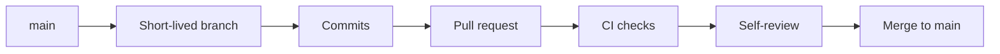

# Git Workflow

## Branch model

`main` is the integration branch. Work happens on short-lived branches and is
merged through pull requests after CI succeeds.



Do not keep a permanent development or documentation branch.

## Starting a task

Example for the next data-layer ticket:

```bash
git switch main
git pull --ff-only
git switch -c VinylApp-014
```

## Before pushing

```bash
dart run build_runner build
dart format .
flutter analyze
flutter test
```

If the Drift schema changed, also regenerate and review the schema snapshot.

## Commit messages

Use imperative, durable descriptions:

```text
Add AlbumRepository search queries
Add ArtistRepository find-or-create behavior
Document repository layer
```

Avoid messages such as `updates`, `fix stuff`, or descriptions of the editing
process rather than the outcome.

## Pull-request titles

Align the title with the task and merged result:

```text
VinylApp-013: Add AlbumRepository
VinylApp-014: Add ArtistRepository
```

The pull-request title and description should read well in long-term history.

## After merge

```bash
git switch main
git pull --ff-only
git branch -d VinylApp-014
```

Delete the remote feature branch when it is no longer needed.
