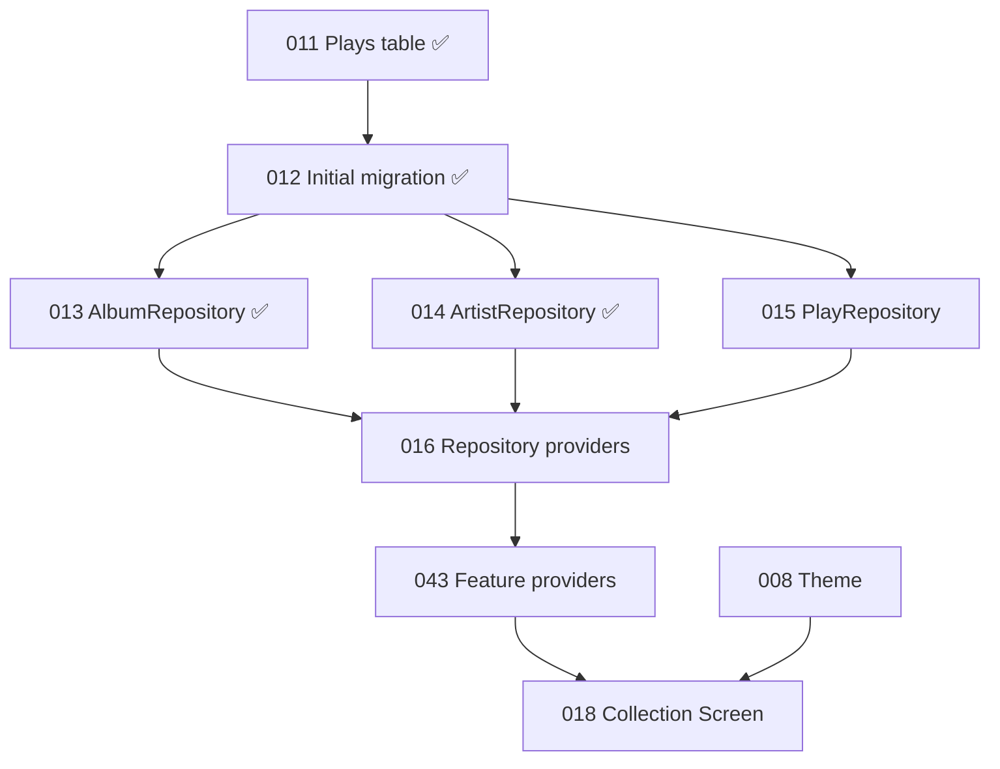

# Current Implementation Status

This page summarizes the implementation state represented by the VinylApp-014
change set. Once the pull request is merged, it describes `main`.

## Implemented

### Foundation

- VinylApp-001 — Flutter project and folder scaffold
- VinylApp-002 — analyzer and lint configuration
- VinylApp-003 — GitHub repository workflow and pull-request template
- VinylApp-004 — GitHub Actions CI
- VinylApp-005 — GoRouter setup
- VinylApp-006 — Riverpod foundation
- VinylApp-007 — Drift and SQLite setup

### Database

- VinylApp-009 — Albums table
- VinylApp-010 — Artists table
- VinylApp-011 — Plays table
- `SidePlayed` persistence with `full`, `sideA`, and `sideB`
- Foreign-key enforcement from `Albums.artistId` to `Artists.id`
- Foreign-key enforcement from `Plays.albumId` to `Albums.id`
- VinylApp-012 — v1 migration and schema version constants
- `drift_schemas/drift_schema_v1.json`
- In-memory database, table, and empty → v1 migration tests

### Repository layer

- VinylApp-013 — `IAlbumRepository`
- Drift-backed `AlbumRepository`
- `findAll()`
- `findById()`
- `create()`
- `update()`
- `delete()`
- `search(query)` across album title and artist name, case-insensitive
- In-memory repository tests for every AlbumRepository operation
- VinylApp-014 — `IArtistRepository`
- Drift-backed `ArtistRepository`
- `findOrCreate(name)` with case-insensitive, idempotent deduplication
- `findById()`
- `findAll()`
- In-memory ArtistRepository tests covering creation, lookup, listing, and
  deduplication

### Current providers

- `routerProvider`
- `databaseProvider`
- `albumRepositoryProvider`
- `artistRepositoryProvider`

The Album and Artist repository providers are introduced with VinylApp-013 and
VinylApp-014. VinylApp-016 still completes and standardizes the remaining
repository-provider layer.

### Current screens

The six routes resolve, but each user-facing screen is still a placeholder:

- Collection
- Statistics
- Discover
- Add Record
- Album Detail
- Log Play

`RouteTestButtons` is temporary navigation scaffolding.

## Not implemented yet

- Theme and design tokens
- PlayRepository
- Remaining repository providers
- PlayLoggingService
- `albumsProvider`
- `collectionFiltersProvider`
- `albumProvider(id)`
- `recentlyPlayedProvider`
- `playCountProvider(albumId)`
- Real Collection UI
- Shared production widgets
- Real add, edit, detail, play, statistics, discovery, recommendation, or NFC
  flows

## VinylApp-018 branch

VinylApp-018 is on hold. An unmerged branch contains a visual prototype with:

- `fakeAlbums`
- local `_sortBy` state
- a delayed fake refresh
- hard-coded presentation colors
- early widget implementations

The branch includes prototypes named:

- `AlbumListTile`
- `BottomNavBar`
- `GenreChip`
- `SummaryBar`
- `EmptyState`
- `FilterChipRow`
- `PrimaryButton`
- `SectionHeader`

These files are not part of `main`, so they must not be marked complete in the
README, changelog, architecture diagrams, or feature status tables.

## Collection dependency chain

VinylApp-017 remains part of the ordered data-layer work because real play
logging depends on `PlayLoggingService`, but VinylApp-043 is the direct provider
prerequisite for the read-only Collection screen.
