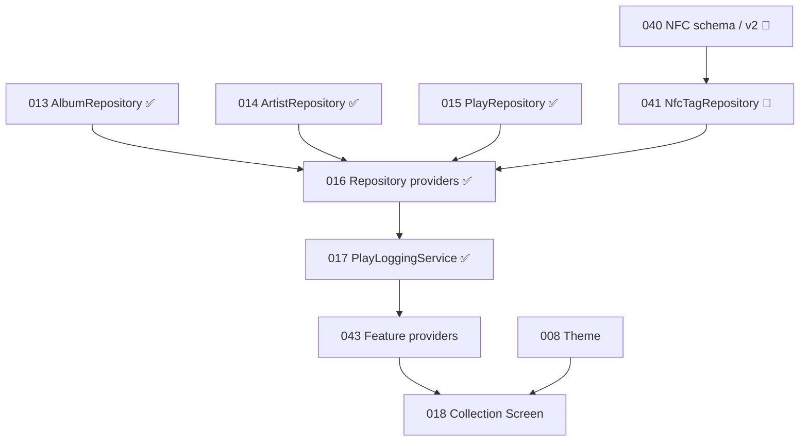

# Current Implementation Status

This page summarizes the post-VinylApp-015 baseline plus the VinylApp-040 schema
and VinylApp-041 NFC repository work in the current change set.

## Implemented

### Foundation

- VinylApp-001 — Flutter project and folder scaffold
- VinylApp-002 — analyzer and lint configuration
- VinylApp-003 — GitHub repository workflow and pull-request template
- VinylApp-004 — GitHub Actions CI
- VinylApp-005 — GoRouter setup
- VinylApp-006 — Riverpod foundation
- VinylApp-007 — Drift and SQLite setup

`databaseProvider` is created at the application root, but the production
connection is backed by `LazyDatabase`. Constructing the provider does not by
itself guarantee that SQLite has opened or migrations have completed.
VinylApp-068 will own explicit startup/bootstrap initialization.

### Database

- VinylApp-009 — Albums table
- VinylApp-010 — Artists table
- VinylApp-011 — Plays table
- `SidePlayed` persistence with `full`, `sideA`, and `sideB`
- Foreign-key enforcement from `Albums.artistId` to `Artists.id`
- Foreign-key enforcement from `Plays.albumId` to `Albums.id`
- VinylApp-012 — immutable v1 baseline and schema snapshot
- `drift_schemas/drift_schema_v1.json`
- VinylApp-040 change set — `NfcTags` table and schema version 2
- One-to-one Album ↔ NFC tag mapping enforced by unique `albumId` and `nfcTagId`
- Explicit v1 → v2 upgrade that creates `nfc_tags`
- Migration coverage for fresh v2 creation and v1 → v2 Artist/Album/Play data preservation

`drift_schemas/drift_schema_v2.json` is the committed schema snapshot for the
VinylApp-040 v2 baseline.

### Repository layer

- VinylApp-013 — `IAlbumRepository` / `AlbumRepository`
- VinylApp-014 — `IArtistRepository` / `ArtistRepository`
- VinylApp-015 — `IPlayRepository` / `PlayRepository`
- Album search across album title and artist name, case-insensitive
- Artist `findOrCreate(name)` with case-insensitive deduplication
- Play counts and SQL-level recently-played aggregation
- Repository creation APIs own generated IDs, creation timestamps, and Drift
  companions so callers do not need to construct persistence objects
- VinylApp-041 — `INfcTagRepository` / `NfcTagRepository`
- NFC tag creation, lookup by physical tag ID, lookup by album, and deletion
- Missing NFC-tag lookups return null rather than throwing
- In-memory repository tests for Album, Artist, Play, and NFC behavior

### Current providers

- `routerProvider`
- `databaseProvider`
- `albumRepositoryProvider`
- `artistRepositoryProvider`
- `playRepositoryProvider`
- `nfcTagRepositoryProvider`

VinylApp-016 completes and standardizes the repository-provider layer with a
central `repository_providers.dart` import surface and ProviderContainer override
coverage for all four repository dependencies.

### Current services

- `PlayLoggingService` — VinylApp-017
- `playLoggingServiceProvider`

`PlayLoggingService.logPlay(albumId, playedAt, side)` validates that the album
exists and creates exactly one Play through `IPlayRepository`. Last-played state
is derived from the Plays table instead of being duplicated on Album rows. NFC
scan flows can resolve a tag first and then use this same logging workflow.

### Current screens

The six routes resolve, but each user-facing screen is still a placeholder:

- Collection
- Statistics
- Discover
- Add Record
- Album Detail
- Log Play

`RouteTestButtons` is temporary navigation scaffolding.

## Not implemented yet

- Theme and design tokens
- `albumsProvider`
- `collectionFiltersProvider`
- `albumProvider(id)`
- `recentlyPlayedProvider`
- `playCountProvider(albumId)`
- Real Collection UI
- Shared production widgets
- Real add, edit, detail, play, statistics, discovery, recommendation, or NFC
  flows

## VinylApp-018 branch

VinylApp-018 is on hold. An unmerged branch contains a visual prototype with:

- `fakeAlbums`
- local `_sortBy` state
- a delayed fake refresh
- hard-coded presentation colors
- early widget implementations

The branch includes prototypes named:

- `AlbumListTile`
- `BottomNavBar`
- `GenreChip`
- `SummaryBar`
- `EmptyState`
- `FilterChipRow`
- `PrimaryButton`
- `SectionHeader`

These files are not part of `main`, so they must not be marked complete in the
README, changelog, architecture diagrams, or feature status tables.

## Collection dependency chain

VinylApp-017 now provides the play-logging workflow. VinylApp-043 remains the
direct provider prerequisite for the read-only Collection screen.
